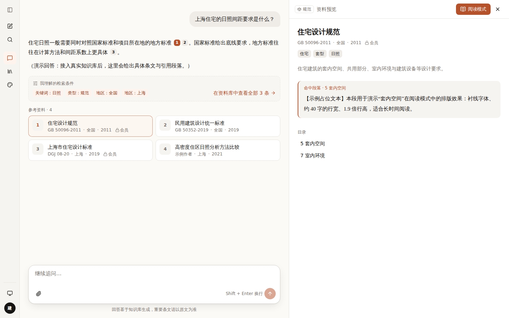
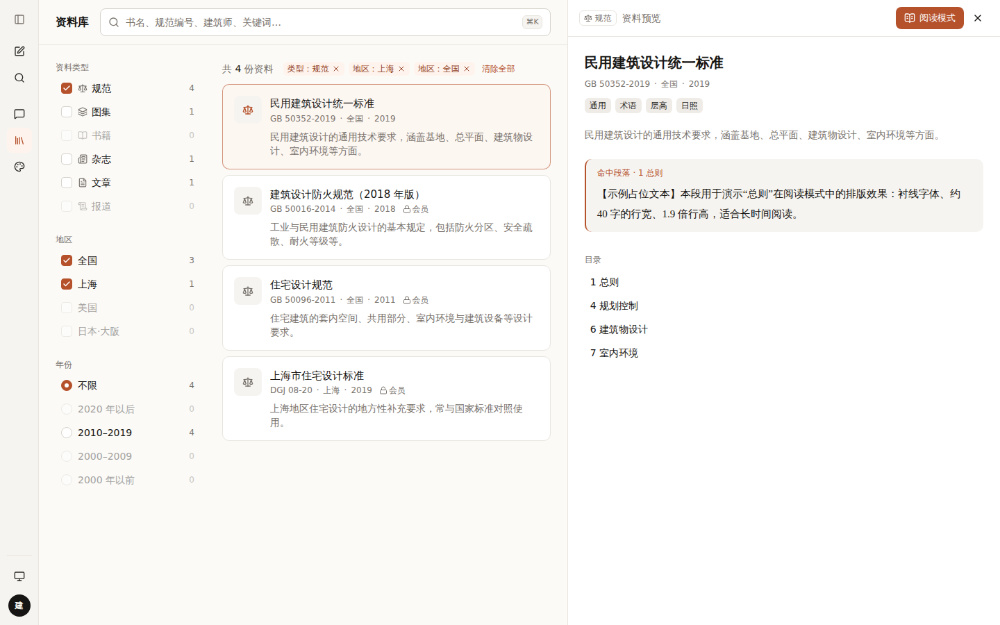
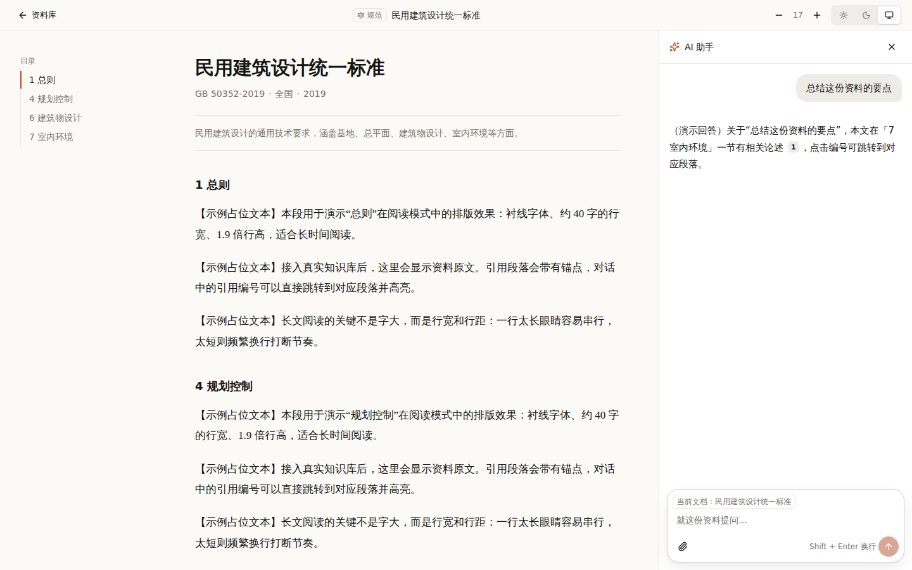
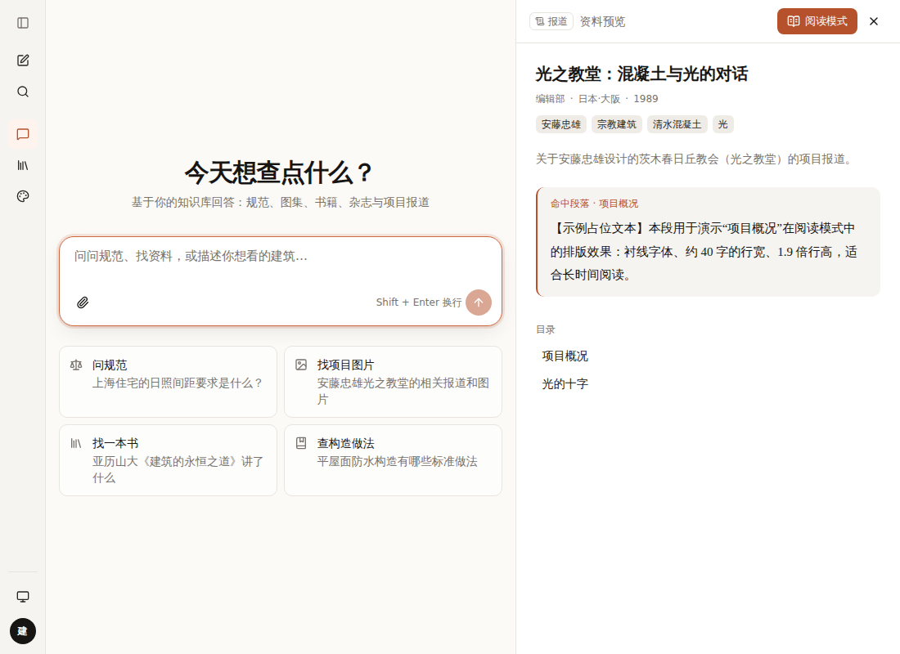

# 001 资料阅览：问 → 找 → 预览 → 阅读

## 要解决的问题

资料有两个入口：
- **对话**：问一个问题，AI 找出相关的规范和书籍（我不确定要找哪本）
- **检索**：我知道名称或条件，直接去找（某地某年的某本书）

两条路最后都要落到“读具体内容”。怎样让它们不打架？

## 方案：两个入口，汇合到同一套“渐进展开”

```
  对话入口                         检索入口
  “上海住宅日照要求？”             类型:规范 · 地区:上海 · 2019
        │                                 │
        ▼                                 ▼
  回答 + 引用编号 [1][2]            结果列表（资料卡片）
  + “我理解的检索条件” ──一键带过去──▶ （同一种筛选格式）
        │                                 │
        └──────────────┬──────────────────┘
                       ▼
          ① 看到：引用编号 / 卡片（悬停显示标题）
          ② 看清：右侧预览面板（元信息、摘要、命中段落、目录）
          ③ 读透：阅读模式（独立页面，无侧栏，衬线正文，右下角 AI 助手）
```

关键点：**资料（Source）是同一个对象，预览面板是同一个组件**。
对话页和资料库页都用 `PeekLayout` 包一层，URL 上的 `?peek=资料id` 决定显示哪份。

| 桌面：对话 + 预览 | 桌面：检索 + 预览 |
|---|---|
|  |  |

| 阅读模式 + AI 助手 | 手机：底部抽屉 | 1100px：侧栏自动收起 |
|---|---|---|
|  |  |  |

## 右侧拉进来时，怎么保证视窗能放下（fit）

| 屏宽 | 容器 | 规则 |
|---|---|---|
| ≥1536 | 分栏 | 侧栏保持展开 |
| 1024–1536 | 分栏 | **侧栏自动收成图标栏**，把宽度让给内容 |
| 1024 以上通用 | 分栏 | 主区最窄 420px；预览默认 45%，最窄 360px，最宽 65%；中间可拖拽 |
| 768–1024 | 右侧抽屉 | 覆盖在主区上，并排会把两边都挤坏 |
| <768 | 底部抽屉 | 占 88% 高度，下滑关闭 |

## 业界做法参考

| 产品 | 做法 | 我们借鉴了什么 |
|---|---|---|
| Perplexity | 回答内的引用编号，悬停显示来源 | 第 ① 级：引用编号 |
| NotebookLM | 点引用在旁边展开原文段落并高亮 | 第 ② 级：命中段落 |
| ChatGPT Canvas / Claude Artifacts | 内容在右侧打开，与对话并排 | 分栏预览 |
| Notion / Linear 的 Peek | 列表里点一项，侧边预览，不离开列表 | 检索结果 → 预览 |
| Google Drive 预览 | 预览里一个按钮“在新窗口打开” | “阅读模式”按钮 |
| Microsoft Copilot | 文档右下角唤起，带当前文档作为上下文 | 阅读页右下角助手 |

## 用到的设计知识

- **渐进展开（Progressive Disclosure）**：先给最少的信息，用户需要时再展开更多。避免一次性把用户扔进全文。
- **Peek（侧边预览）**：在不离开当前页面的情况下查看详情，保留上下文。
- **URL 即状态**：面板开关写进 URL，后退键能关闭面板，链接可以分享。
- **分面检索（Faceted Search）**：每个筛选项后面显示结果数，点之前就知道会不会筛没了。灰掉的选项 = 0 条。
- **Doherty 阈值**：系统要在 400ms 内给出反馈，所以先显示“正在检索规范库…”，再逐字输出。
- **行宽（Measure）**：阅读正文限制在约 42rem，每行 35–40 个汉字，行高 1.9。

## 备选方案与取舍

| 方案 | 优点 | 缺点 | 结论 |
|---|---|---|---|
| 点引用直接跳到阅读页 | 简单 | 离开对话，丢失上下文，来回跳很累 | ✗ |
| 弹窗（Modal）预览 | 实现简单 | 挡住对话，无法边看边问 | ✗ |
| **右侧分栏预览 + 独立阅读页** | 保留上下文，按需深入 | 要处理响应式 | ✓ 采用 |
| 预览面板里直接放全文 | 少一步 | 面板窄，长文阅读体验差 | ✗，全文交给阅读模式 |

## 待你决定

- [ ] 阅读模式要不要保留左侧导航？A 不保留（当前，推荐：专注阅读）/ B 保留图标栏
- [ ] 对话里的检索条件卡片：A 一直显示（当前）/ B 只在结果超过 N 条时显示
- [ ] 下一步做“文档对比”（两份资料左右对照、同步滚动）还是“图片检索结果页”？

## 改动位置

`src/components/shell/peek-layout.tsx`、`src/hooks/use-peek.ts`、`src/components/source/*`、
`src/components/library/*`、`src/components/reader/*`、`src/components/blocks/filters-block.tsx`
