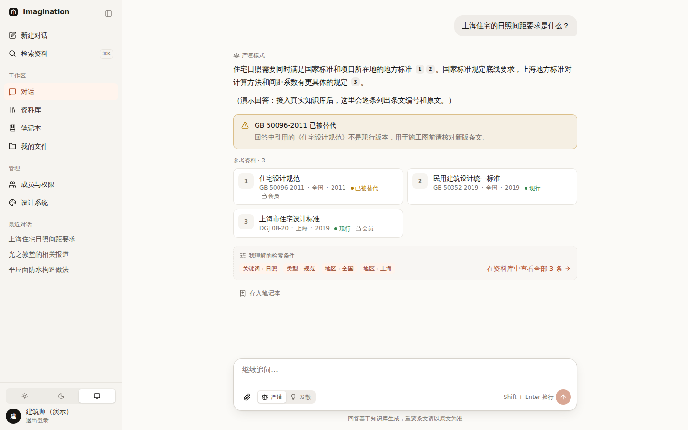
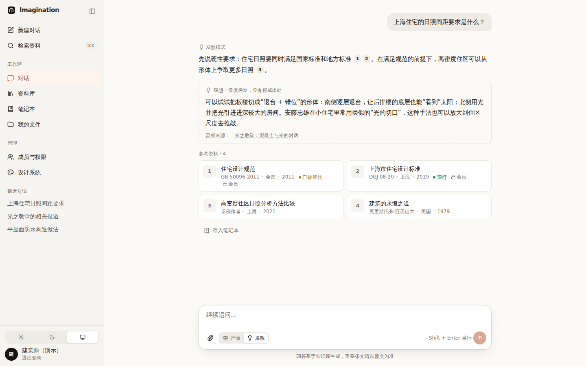
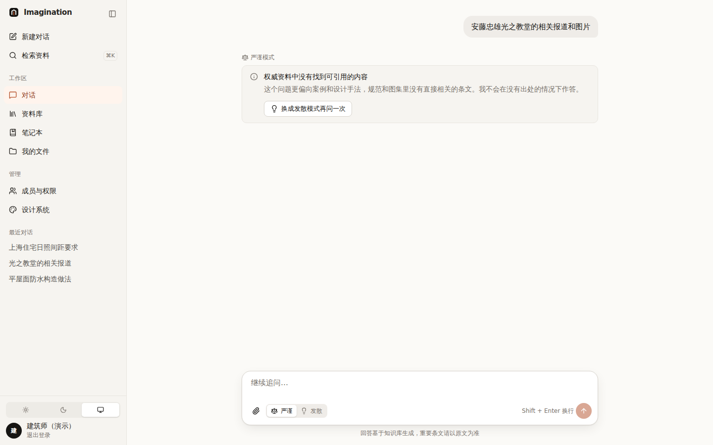

# 002 对话的两种模式：严谨 / 发散

## 要解决的问题

技术问题必须有出处；设计问题需要联想。同一个对话框，怎么让两种回答都成立，而且用户分得清？

## 方案

输入框里放一个 **严谨 | 发散** 分段控件。选择会被**记住**（个人偏好），下次新建对话沿用。

| 严谨模式 | 发散模式 | 严谨模式下找不到出处 |
|---|---|---|
|  |  |  |

| | 严谨 | 发散 |
|---|---|---|
| 可用资料 | 权威等级 1–2（规范规章、图集） | 全部 |
| 找不到出处 | 明说“没有找到”，提供“换成发散模式再问一次” | 用论文、案例补充 |
| 规范状态 | 引用了“已被替代 / 已废止”的规范时，**必须**出现警示 | 同样显示 |
| 联想内容 | 不出现 | 放进**虚线框 + “联想”标签**，与正文分开 |

## 用到的设计知识

- **信任校准（Trust Calibration）**：让用户对 AI 的信任程度与它的可靠程度相符。有出处的用实线引用，没出处的用虚线框，视觉差异就是可靠性差异。
- **偏好持久化**：用户做过的选择，下次不要再让他做一遍。出处：Laws of UX 的 *Tesler 定律*（复杂度守恒，系统应替用户承担）。
- **分段控件（Segmented Control）**：2–4 个互斥选项并排、当前项浮起。比下拉菜单少一次点击，且所有选项一眼可见。出处：Apple HIG。
- **不只用颜色传达信息（WCAG 1.4.1）**：规范状态用“圆点 + 文字”，色弱用户也能分辨。
- **可恢复的空结果**：“没找到”时给出下一步（换模式），而不是死胡同。

## 备选方案与取舍

| 方案 | 优点 | 缺点 | 结论 |
|---|---|---|---|
| AI 自动判断模式 | 用户不用选 | 判断错时用户不知道为什么回答风格变了 | ✗（以后可做“建议切换”提示） |
| **用户选择 + 记住偏好** | 可预期、尊重个人习惯 | 多一个控件 | ✓ |
| 两个独立的对话入口 | 概念最清楚 | 同一个问题想换个角度问要换页面 | ✗ |

## 待你决定

- [ ] 模式偏好存在哪：A 跟账户走，换电脑也记得（推荐，需要后端）/ B 只存在当前浏览器（现在的演示做法）
- [ ] 团队管理员能否**强制**某些人只能用严谨模式（比如施工图阶段）？A 可以 / B 不需要

## 改动位置

`src/lib/chat/modes.ts`、`src/components/chat/mode-switch.tsx`、`src/components/blocks/{idea,notice}-block.tsx`、
`src/lib/chat/mock-responder.ts`、`src/lib/sources/kinds.ts`（权威等级）
