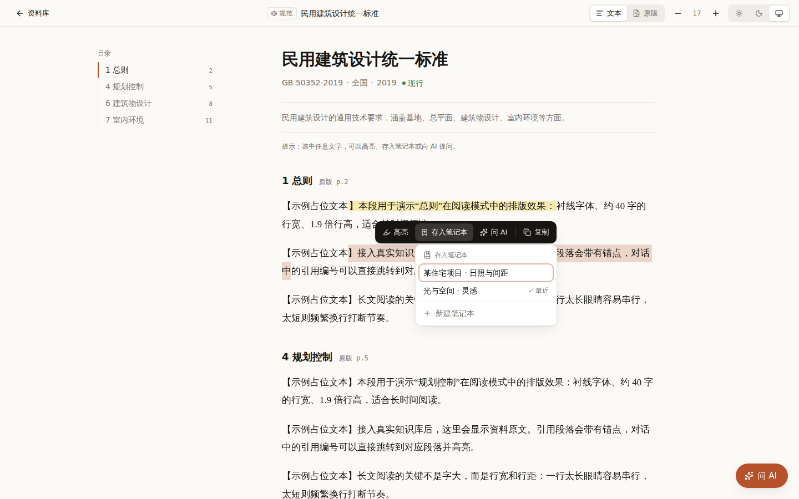
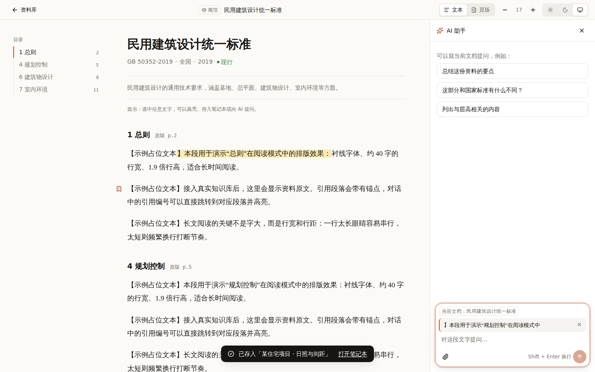
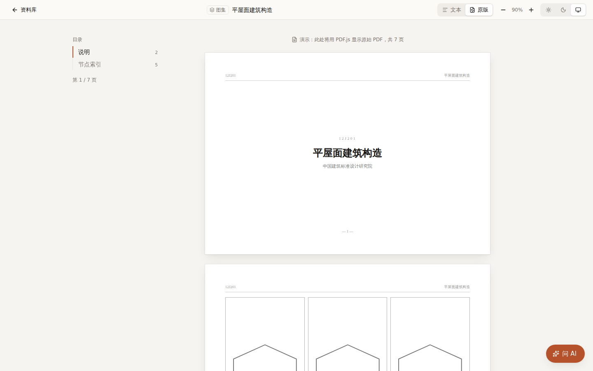
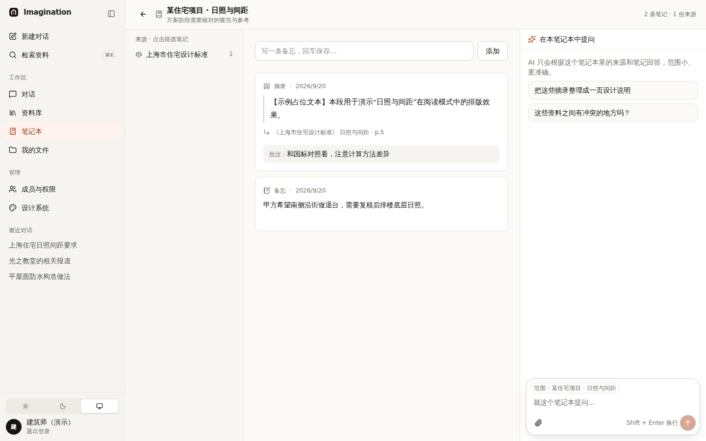
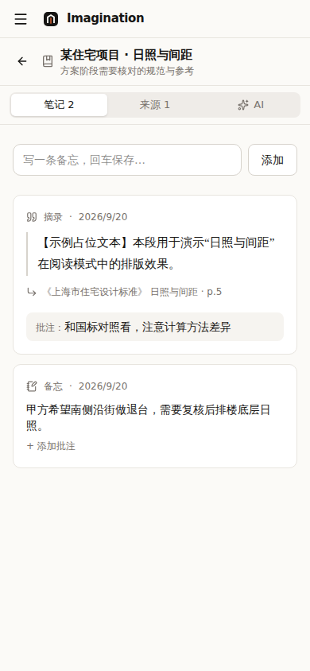

# 003 阅读器（原版 / 文本）与笔记本

## 要解决的问题

1. PDF 和解析后的文本各有长处，怎么同时提供？
2. 读的时候怎么顺手记下来，并且以后能回到原文？
3. 笔记怎么反过来帮助问答？

## 方案

**阅读器**：顶栏 **文本 | 原版** 切换，切换时停在对应位置（段落 ⇄ 页码）。图集默认原版，其余默认文本。

**选中文字 → 浮动工具栏**：高亮 / 存入笔记本 / 问 AI / 复制（自动附出处）。

| 选中后存入笔记本 | 选中后“问 AI”（带着引用） | 图集默认原版 |
|---|---|---|
|  |  |  |

**笔记本**（参考 NotebookLM）：来源清单 | 笔记（摘录、AI 回答、备忘、批注） | 只在本笔记本范围内回答的 AI。每条摘录都有**回链**（资料 + 章节 + 页码）。

| 桌面三栏 | 手机分段切换 |
|---|---|
|  |  |

## 用到的设计知识

- **上下文操作（Contextual Action）**：操作出现在对象旁边（选中文字的正上方），而不是藏在菜单里。代表：Medium、Notion、Kindle。
- **费茨定律（Fitts's Law）**：目标越近、越大越好点。工具栏贴着选区出现。
- **触屏的差异**：手机上系统自带“复制/全选”菜单会出现在选区附近，所以我们的工具栏改到屏幕底部，避免打架。出处：Apple HIG。
- **高亮 ≠ 摘录**：高亮是在书上画线（留在原文里），摘录是抄到本子上（进入笔记本、可批注、可被 AI 使用）。
- **新令牌 `--highlight`**：高亮沿用纸质书荧光笔的黄色，不占用强调色——强调色只用于操作和位置。
- **原版纸张用 `--paper / --ink`**：PDF 是印刷品，暗色模式下不反色，只略微压暗。
- **范围限定的 AI**：问题范围越小，回答越准；个人批注只作补充，永远标为个人观点（权威等级 5）。

## 备选方案与取舍

| 方案 | 结论 |
|---|---|
| 只提供 PDF | ✗ 手机上难读、无法精确引用到段落 |
| 只提供文本 | ✗ 图集、图纸必须看原版 |
| **两种视图 + 位置同步** | ✓ |
| 笔记放在单独的“笔记应用” | ✗ 摘录时要切换应用，回链会断 |

## 待你决定

- [ ] 高亮是否对团队可见？A 仅自己（推荐，现在的做法）/ B 可以共享给同一项目的人
- [ ] 笔记本是否可以多人协作（同一项目组共同编辑）？A 以后做 / B 现在就规划
- [ ] 复制时自动附出处：A 默认开启（推荐）/ B 做成可选

## 改动位置

`src/components/reader/*`、`src/components/notebook/*`、`src/lib/notebook/store.ts`、`src/app/globals.css`（highlight / paper / ink）
