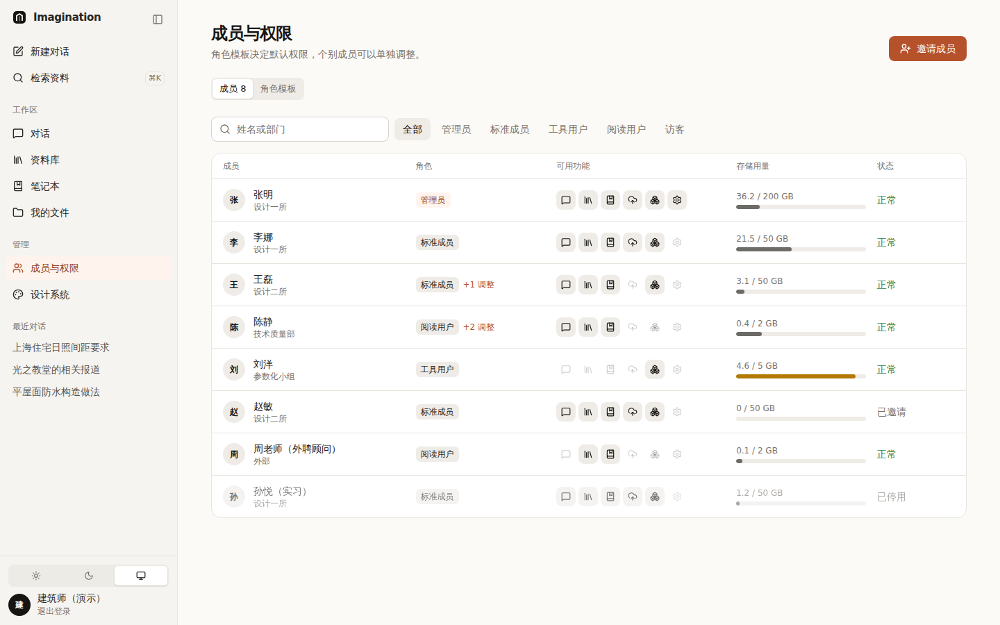
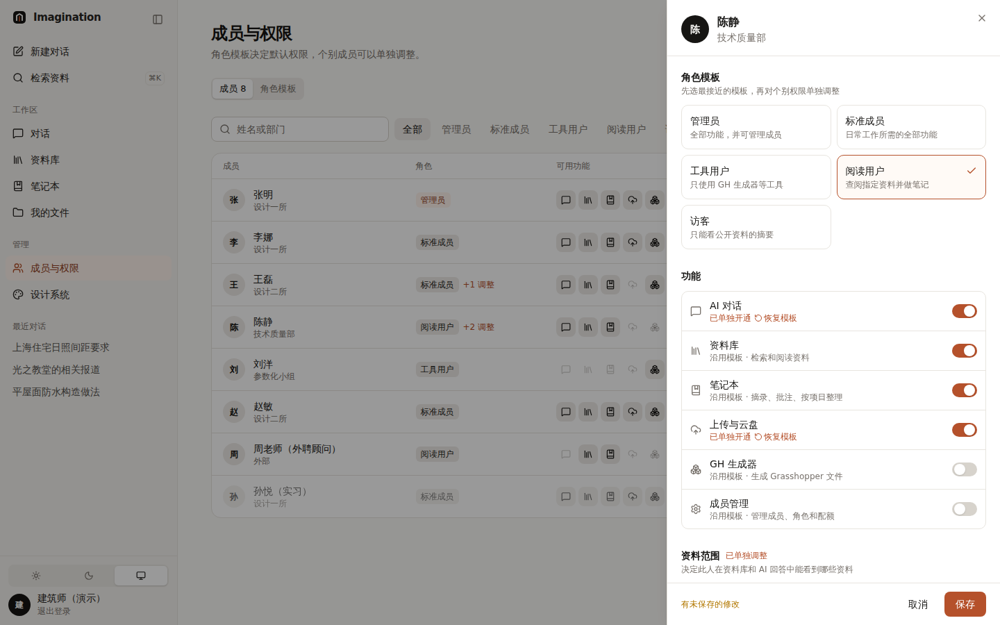
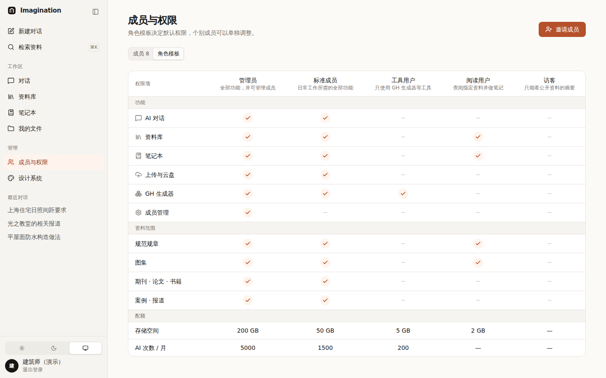

# 004 账户与权限

## 要解决的问题

谁是“标准配置”，谁只能用一两样功能？怎样一眼看清、改起来不乱？

## 方案

权限 = **功能 × 资料范围 × 配额**；管理方式 = **角色模板 + 个人单独调整**（只记录和模板不同的地方）。

| 成员列表 | 编辑某个人 | 角色模板矩阵 |
|---|---|---|
|  |  |  |

- 列表里每人一行：角色、**“+2 调整”** 提示、6 个功能图标（亮 = 可用）、存储用量条。
- 编辑面板：先选模板，再用开关微调；每个开关标明“沿用模板”还是“已单独开通 / 关闭”，可一键**恢复模板**；底部实时预览“这个人看到的侧栏”。
- 改动先进草稿，点“保存”才生效；有未保存修改时有提示。

## 用到的设计知识

- **基于角色的访问控制（RBAC）**：先定义角色，人归属于角色。好处是新人入职只要选角色。
- **例外管理**：只把“和模板不同”的地方标出来，管理员一眼就知道谁被特殊对待了。
- **开关 vs 复选框**：开关表示“立即生效”的设置；这里是“草稿 + 保存”，严格说应该用复选框。考虑到权限列表是“开 / 关”语义、且有明确的保存栏，这里仍用开关——记下来，测试时观察用户是否误以为已生效。
- **所见即所得预览**：改权限时直接看到对方的界面，减少“我以为关了其实没关”的错误。
- **隐藏 vs 置灰**：没有权限的功能**从导航里隐藏**（用户不需要知道它存在）；如果通过链接误入，显示“无权限”说明页和联系人。
- **安全提示**：界面隐藏只是体验，服务端必须再校验一次。

## 待你决定

- [ ] 登录方式：A 企业微信 / 钉钉 / 飞书扫码（推荐，入职离职自动同步）/ B 手机号验证码 / C 都要
- [ ] 资料范围是否要细到“某个项目的资料只有项目组能看”？A 需要 / B 暂不需要
- [ ] 权限开关是否改成复选框（更符合“保存才生效”）？A 保持开关，测试后再说（推荐）/ B 改

## 改动位置

`src/lib/auth/permissions.ts`、`src/components/admin/*`、`src/components/ui/{switch,meter}.tsx`
