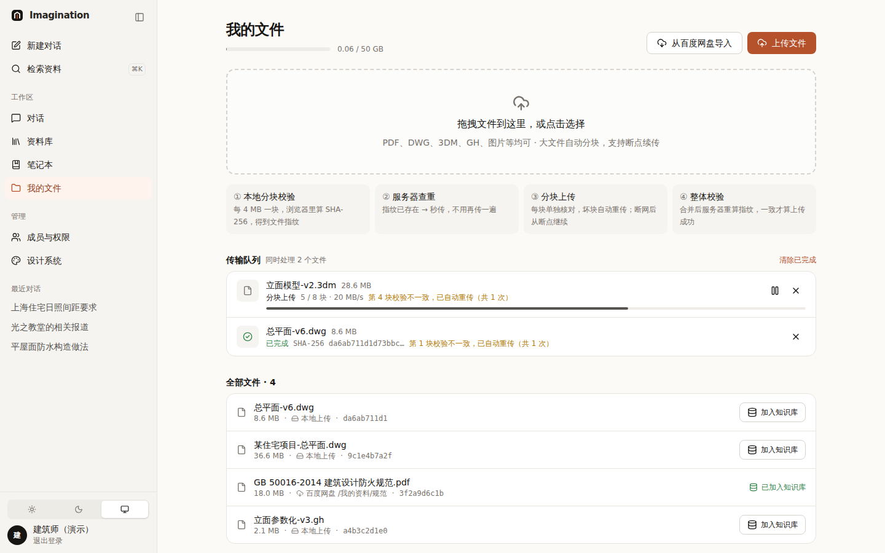
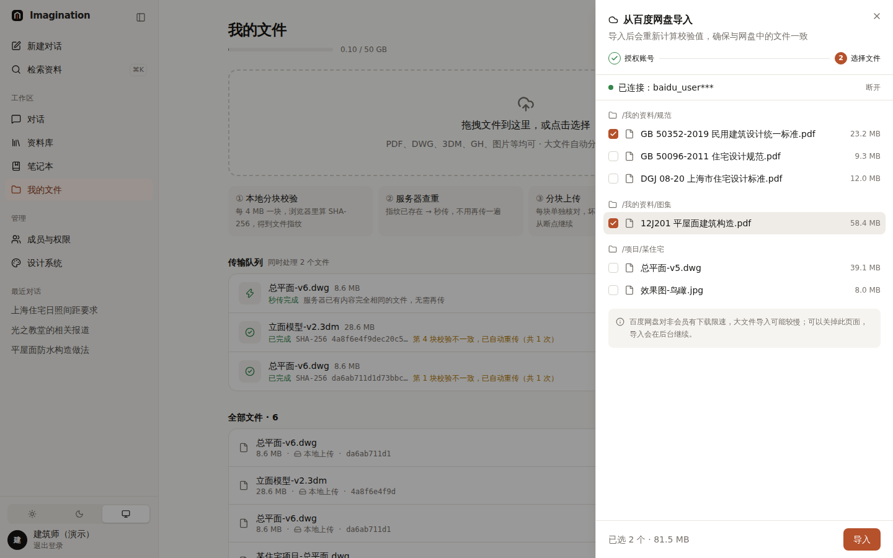
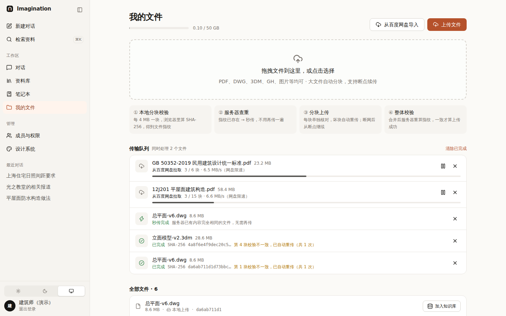
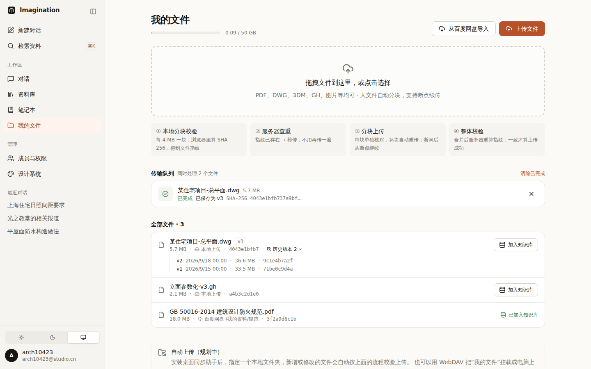

# 005 上传、校验与百度网盘导入

## 要解决的问题

本地文件（图纸、模型，经常几百 MB）怎样稳定上传、确保不坏？百度网盘里的资料怎么拿进来？

## 方案

**本地上传四步校验**（页面上直接展示给用户看）：

```
① 本地分块校验   每 4 MB 一块，浏览器算 SHA-256 → 所有块的哈希再算一次 = 文件指纹
② 服务器查重     指纹已存在 → 秒传（不用再传）
③ 分块上传       每块带自己的哈希，服务器逐块核对，不一致就只重传这一块；断网后从断点继续
④ 整体校验       合并后服务器重算指纹，一致才算成功
```

演示中 ① 是**真实计算**，②③④ 是模拟（约 7% 概率模拟坏块，用来展示自动重传）。

**百度网盘**：两步——授权 → 勾选文件 → 导入。**只做单向导入**，不修改网盘文件；页面提示非会员限速。

| 上传中（坏块自动重传） | 选择网盘文件 | 网盘导入 + 秒传 |
|---|---|---|
|  |  |  |

**云盘文件 ≠ 知识库资料**：上传后只是“存着”；点“加入知识库”才会被解析、建索引、可被 AI 引用。

## 用到的设计知识

- **系统状态可见（尼尔森可用性原则 #1）**：每个文件都显示“现在在第几步、第几块、多快、出过什么问题”。
- **让用户相信**：把校验流程画在页面上，用户就知道“传上去的就是原来那份”。
- **错误要说人话 + 给出路**：“网络中断，已上传的块会保留，可以继续”，而不是“Error 500”。
- **可恢复性**：暂停 / 继续 / 重试都从断点开始，不让用户从头再来。
- **进度条 vs 用量条**：进度条会走完并结束；用量条表示“已用 / 上限”，超过 85% 变警示色。
- **整页拖拽**：拖文件进页面任意位置都能上传，拖进来时出现全屏提示。

## 备选方案与取舍

| 方案 | 结论 |
|---|---|
| 整个文件一次上传 | ✗ 大文件一断就要从头来 |
| 只用 MD5 | ✗ SHA-256 更安全，浏览器原生支持 |
| 百度网盘双向同步 | ✗ 没有变更通知、需轮询、冲突难解释；先做单向导入 |
| 桌面同步助手 / WebDAV | ✓ 规划中，作为“自动上传”的方案 |

## 待你决定

- [ ] 单文件大小上限：A 5 GB（推荐）/ B 20 GB（需要更长的续传保存期）
- [ ] 同名不同内容的文件：A 自动保留两份并加版本号（推荐）/ B 询问是否覆盖
- [ ] 百度网盘导入后是否**自动**加入知识库？A 否，由用户决定（推荐）/ B 规范类自动加入

## 改动位置

`src/lib/files/*`、`src/components/files/*`

## 更新（v0.3）：文件版本

已定：**同名但内容不同 → 自动保存为新版本**，旧版本保留。

| 情况 | 处理 |
|---|---|
| 同名、内容相同（指纹一致） | 不重复保存，提示“云盘中已有（v2）” |
| 同名、内容不同 | 保存为 v(n+1)，列表显示当前版本，历史版本可展开 |
| 新文件名 | v1 |



- **设计知识**：*渐进展开*——列表只显示当前版本，历史折叠在“历史版本 2”里，需要时再看。
- 历史版本也占存储空间，用量条按所有版本计算。
- **已定：历史版本永久保留**（图纸需要追溯）
- 待定：[ ] 是否提供“恢复为当前版本”？A 需要（推荐）/ B 暂不需要
