# 006 邮箱验证码登录与账户偏好

## 已定下来的

- 登录方式：**邮箱 + 6 位验证码**，不设密码；第一次登录自动创建账户
- 对话模式等偏好**跟着账户走**，换电脑、换浏览器登录都沿用
- 同名但内容不同的文件：**自动保留，加版本号**（见 [005](./005-upload-sync.md)）

## 方案

```
 /chat（未登录）──proxy 拦截──▶ /login?next=/chat
                                   │ ① 输入邮箱 → 获取验证码
                                   │ ② 输入 6 位（输满自动提交）
                                   ▼
                        服务器写入登录 Cookie ──▶ 回到 /chat
                        （httpOnly + 签名，30 天）   读取账户偏好（严谨 / 发散）
```

| 输入邮箱 | 输入验证码 | 输错时 |
|---|---|---|
| 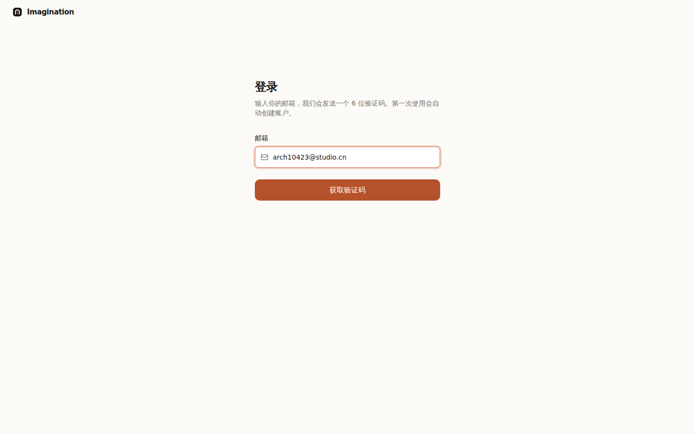 | 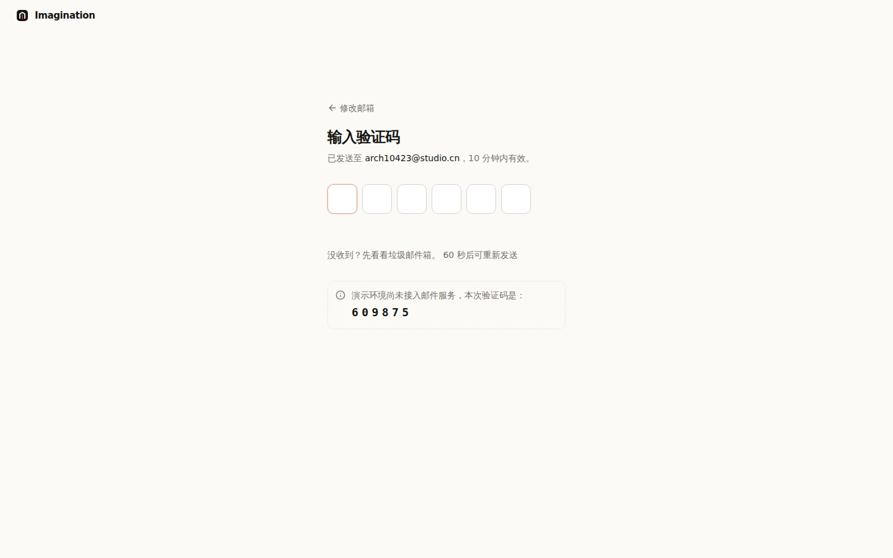 | 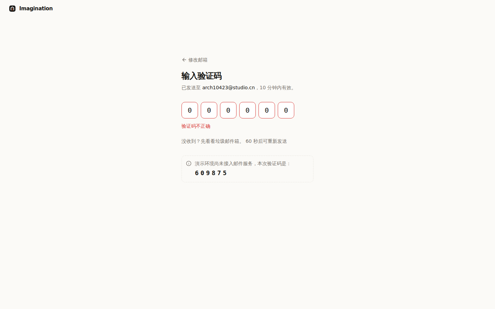 |

| 另一台电脑登录，偏好自动沿用 | 账户设置 | 用户菜单 |
|---|---|---|
| 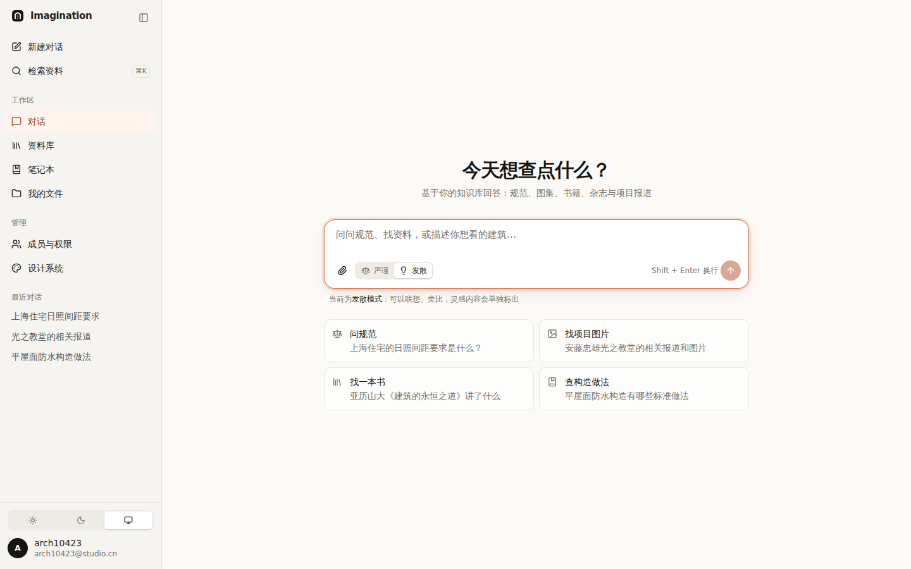 | 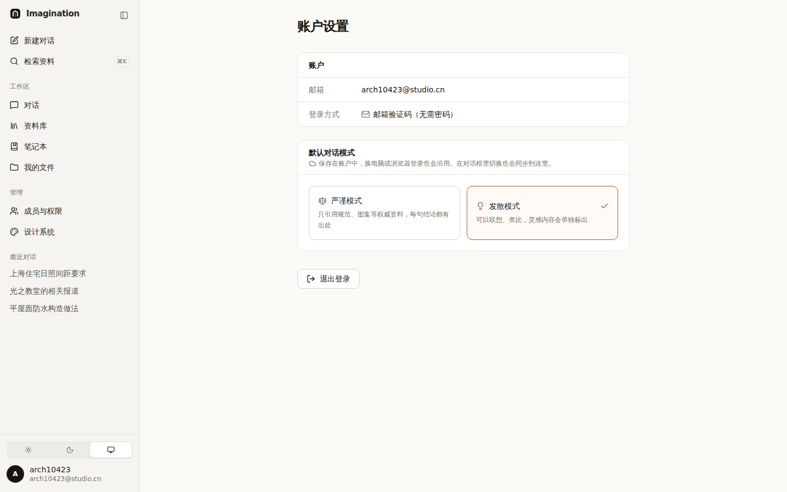 | 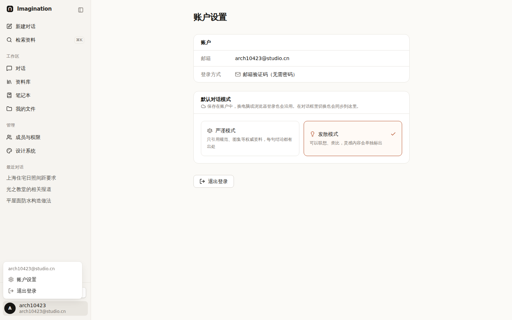 |

## 安全做法（已实现，演示环境也生效）

| 做法 | 防什么 |
|---|---|
| 验证码只存哈希，不存明文 | 服务器数据泄露后验证码仍不可用 |
| 10 分钟过期、用一次就作废 | 旧验证码被人看到也没用 |
| 同一邮箱 60 秒内不能重发 | 被人用来轰炸别人的邮箱 |
| 最多输错 5 次，之后必须重新获取 | 暴力猜测（6 位数字有 100 万种可能） |
| 登录 Cookie：httpOnly + HMAC 签名 | 页面脚本偷不走；改了邮箱签名就对不上 |
| `next` 参数只允许站内地址 | 开放重定向——被用来把人从我们的登录页骗去钓鱼网站 |
| proxy 拦截 + 页面和接口各自再校验一次 | 单点失效 |

演示环境**没有真正发邮件**，验证码直接显示在页面上（可以点击填入）。接入邮件服务后设置 `AUTH_DEMO=off` 关闭。

## 用到的设计知识

- **无密码登录（Passwordless）**：Notion、Slack、Linear 都支持“邮箱收码 / 收链接”登录。用户不用记密码，也就没有“忘记密码”流程。
- **分步表单**：一屏只做一件事（先邮箱，后验证码），并且可以返回“修改邮箱”。
- **自动提交**：6 位输满就验证，少按一次按钮。
- **一次性验证码输入框**：6 个格子，自动跳格、支持粘贴；`autocomplete="one-time-code"` 让手机能从通知里直接填入。出处：Apple HIG。
- **出错反馈**：变红 + 文字 + 轻微抖动；系统开启“减少动态效果”时不抖（WCAG 2.3.3）。
- **乐观更新**：切换模式时界面立即变化，同时后台保存；保存失败再改回来。
- **服务端带入初始值**：偏好在页面渲染时就从服务器读好，打开页面不会先显示默认值再跳变。

## 待你决定

- [ ] 登录有效期：A 30 天（推荐，现在的设置）/ B 7 天 / C 每次关浏览器都要重新登录
- [ ] 是否限制只有公司域名的邮箱能注册（如 `@yourfirm.com`）？A 限制，外部顾问由管理员邀请（推荐）/ B 不限制
- [ ] 邮件服务：A 阿里云邮件推送（国内送达率高，推荐）/ B 腾讯云 SES / C SendGrid

## 注意（演示版的局限）

- 验证码和账户偏好存在服务器**内存**里，服务重启会清空；上线时换成数据库 / Redis。
- 笔记本、文件列表目前仍存在浏览器本地（localStorage），**还没有**跟账户绑定；接后端时一起迁移。
- 需要设置环境变量 `AUTH_SECRET`（随机长字符串）作为签名密钥，不设置时使用开发用的默认值。

## 改动位置

`src/proxy.ts`、`src/lib/server/{session,otp,prefs,current-user}.ts`、`src/app/api/{auth,account}/**`、
`src/components/account/*`、`src/components/ui/otp-input.tsx`、`src/app/(public)/login`、`src/app/(app)/settings`

## 更新（v0.4）：邀请制、设备限制、按权限显示

### 已定下来的

| 项 | 决定 |
|---|---|
| 登录有效期 | 30 天 |
| 注册方式 | **邀请制**：只有管理员邀请过的邮箱能登录；必须是工作单位邮箱（拒绝 QQ、163、Gmail 等个人邮箱） |
| 设备限制 | **1 台电脑 + 1 台手机**同时在线；同类设备上再登录，之前那台自动退出 |
| 默认邮箱 | 邀请链接自带邮箱；否则填上次登录的邮箱。打开登录页直接点“登录”即可收验证码 |

| 被挤下线的设备 | 已登录的设备 | 邀请：个人邮箱被拒 |
|---|---|---|
| 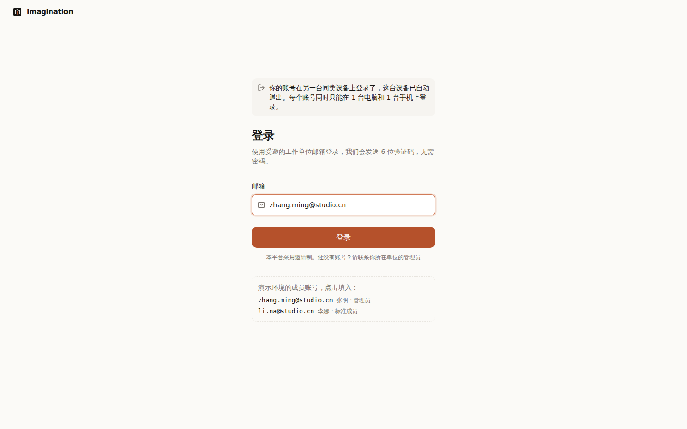 | 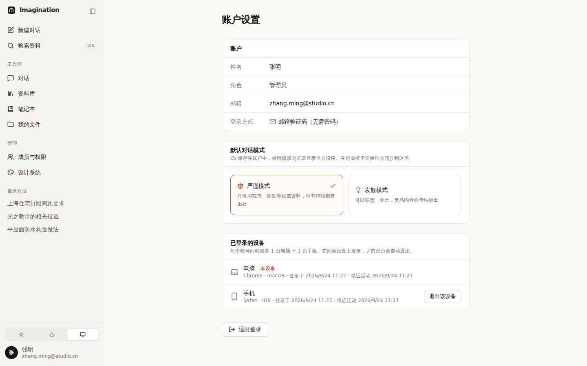 | 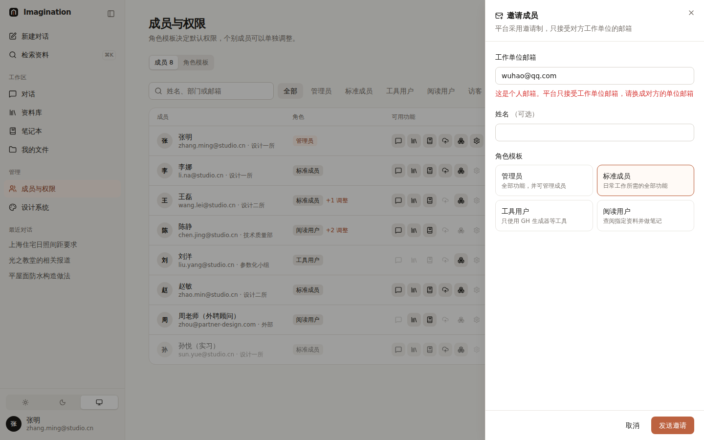 |

| 未受邀邮箱 | 阅读用户登录后（只见有权限的入口） | 误入无权限页面 |
|---|---|---|
| 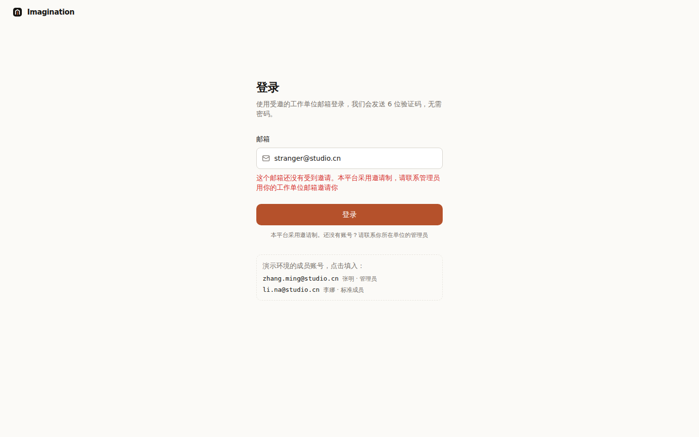 | 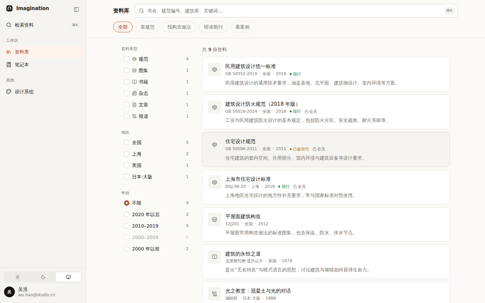 | 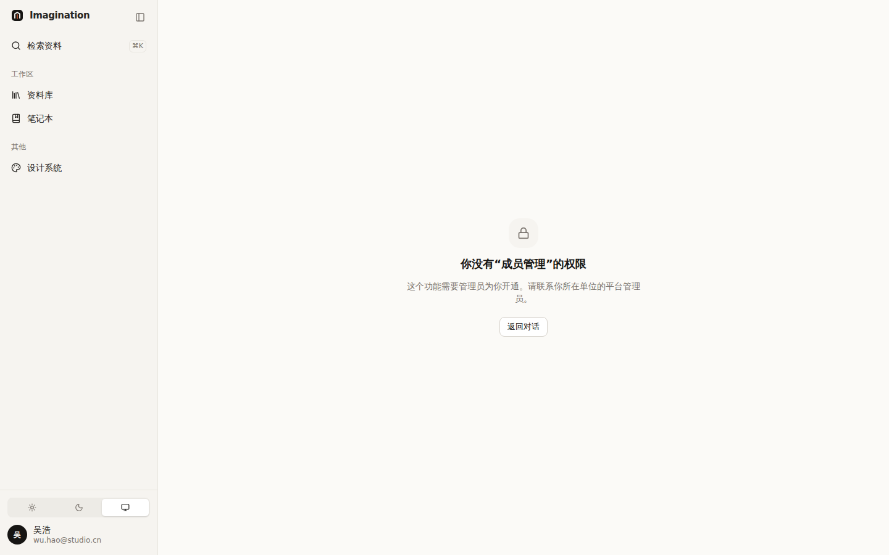 |

### 怎么实现的

- **会话存在服务器**：Cookie 里只有“会话编号 + 签名”，服务器记录每个会话属于谁、哪类设备（按浏览器标识判断手机 / 电脑）。
  新登录时把同类设备上的旧会话标记为“被替代”；旧设备下次访问时被带到登录页，并说明原因。
- **设备策略可调**：`src/lib/server/session.ts` 里的 `MAX_SESSIONS_PER_DEVICE_TYPE` 和 `SINGLE_SESSION_PER_ACCOUNT`。
- **成员名单在服务器**：邀请、改角色、停用都走 `/api/admin/members`，每个方法先校验“当前用户是管理员”。
- **停用立即生效**：会话校验时会查成员状态，停用后此人所有设备下一次请求就被退出。
- **按权限显示**：侧栏只显示有权限的入口（隐藏而不是置灰）；每个页面在服务端再检查一次，误入时显示“无权限”说明页；登录后默认进入此人有权限的第一个页面。

### 用到的设计知识

- **说明原因的状态页**：被挤下线、被停用、登录过期，都在登录页顶部说明原因——用户不会以为是系统出错。
- **系统状态可见**：“已登录的设备”让用户知道自己在哪些设备上登录，并能手动让某台退出（比如手机丢了）。
- **在错误发生前阻止（防错）**：邀请时就拒绝个人邮箱，而不是等对方登录失败。出处：尼尔森可用性原则 #5。
- **最小权限**：新成员默认角色是“标准成员”，更大的权限由管理员单独开通。

### 演示账号

`zhang.ming@studio.cn`（管理员）、`li.na@studio.cn`（标准成员）等，见 `src/lib/auth/permissions.ts`。登录页会列出，点击即可填入。
