# 007 文件浏览：左侧目录 + 中间阅读

## 要解决的问题

平台资料库和个人文档都需要“按目录浏览 → 打开阅读”。左侧清楚地列出能读的文件，也能隐藏；中间显示内容。
常见格式（Office、PDF、图片、DWG、Rhino、压缩包）哪些能在网页里打开，怎么做到？

## 方案

```
┌ 应用侧栏（自动收成图标）┬ 目录树（可拖宽 / 收起）┬ 面包屑 · 下载 · 信息 ──────────┬ 信息（可选）┐
│                      │ ⌕ 过滤文件名          │                               │            │
│                      │ ▾ 某住宅项目          │   按格式选择的查看器             │            │
│                      │   ▸ 01 资料依据       │   （PDF / 图片 / 三维 / 表格…）   │            │
│                      │ ▸ 资料库（平台）       │                               │            │
└──────────────────────┴──────────────────────┴───────────────────────────────┴────────────┘
```

| 什么都没选：告诉你能打开什么 | Markdown | PDF（中文，按需渲染） |
|---|---|---|
| 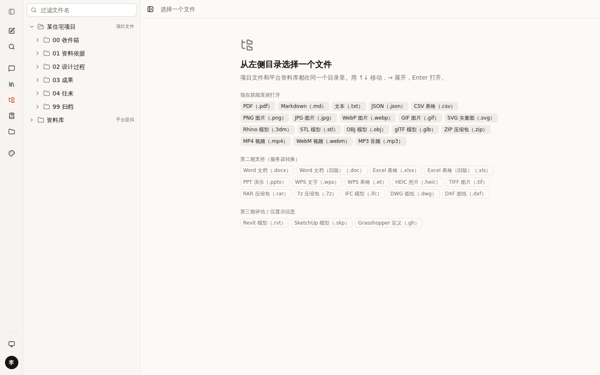 | 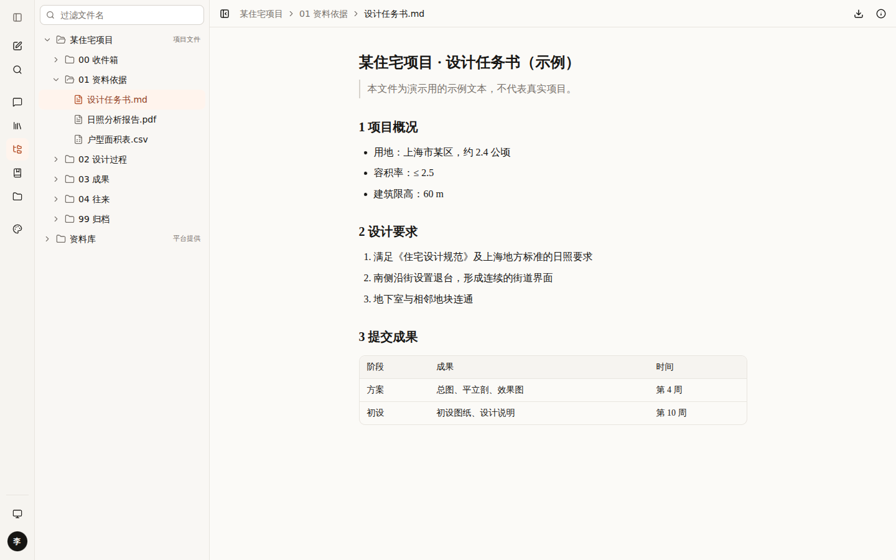 | 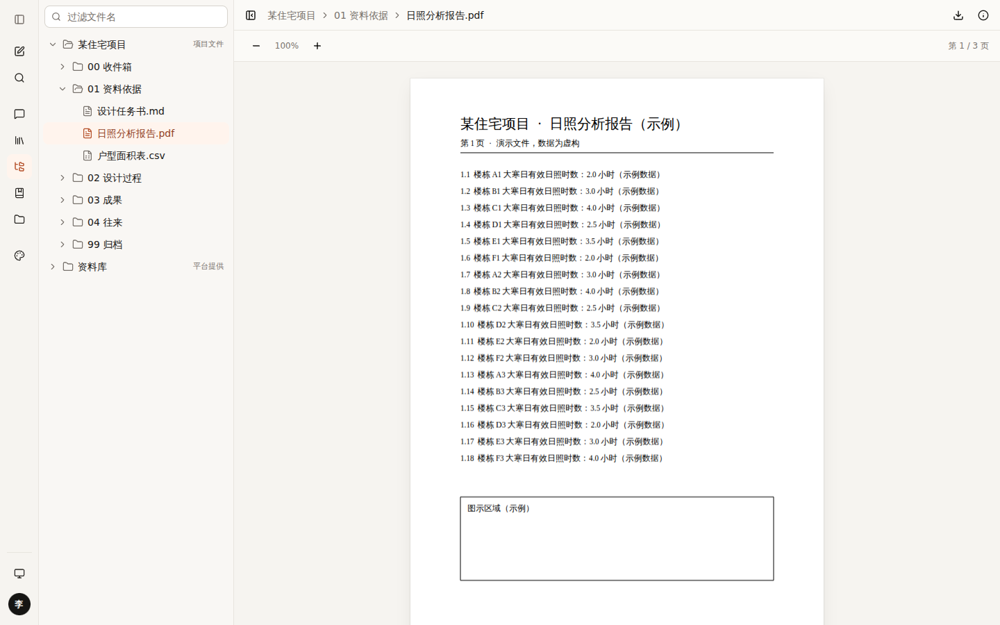 |

| Rhino 3dm（图层可开关） | 关掉“退台”图层 | STL |
|---|---|---|
| 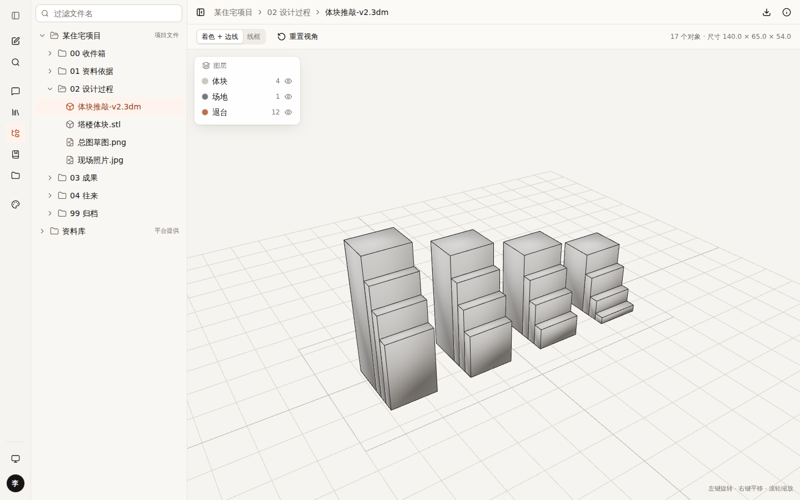 | 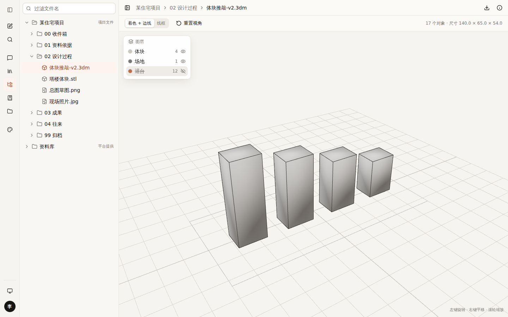 | 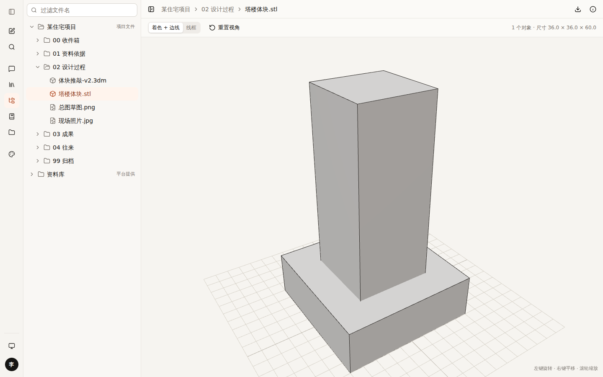 |

| DWG：说明 + 下载（逐级降级） | 压缩包内的图片（GBK 文件名已识别） | 平台资料也在同一棵树里 |
|---|---|---|
| 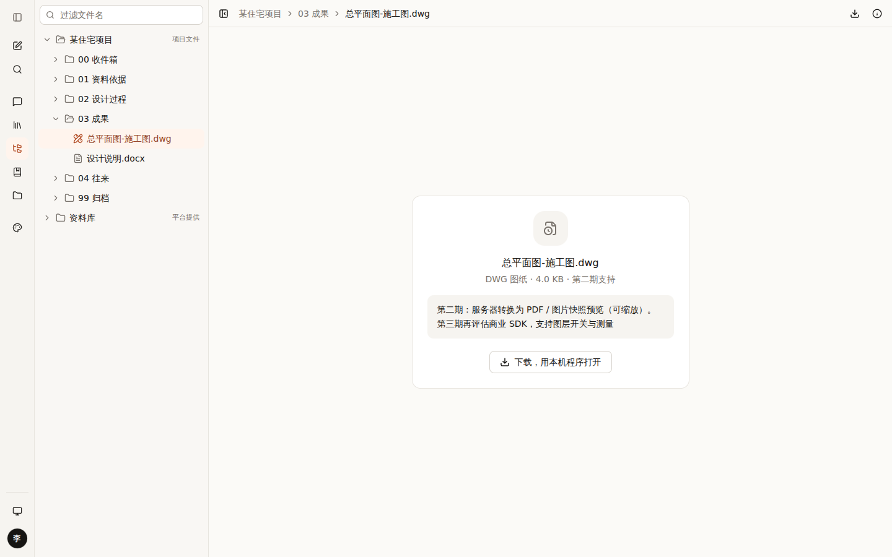 | 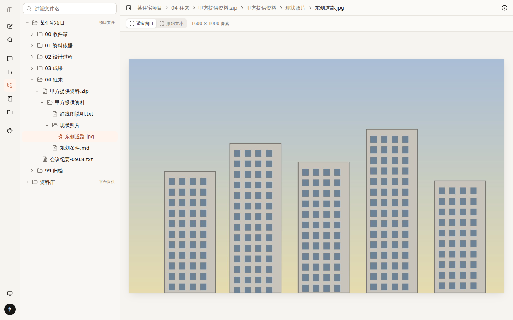 | 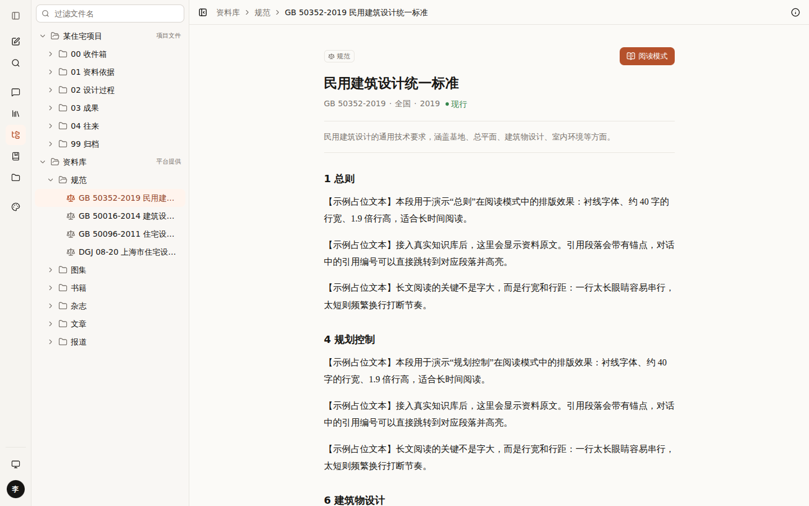 |

| 收起目录，专心阅读 | 过滤文件名 | 手机：目录变抽屉 |
|---|---|---|
| 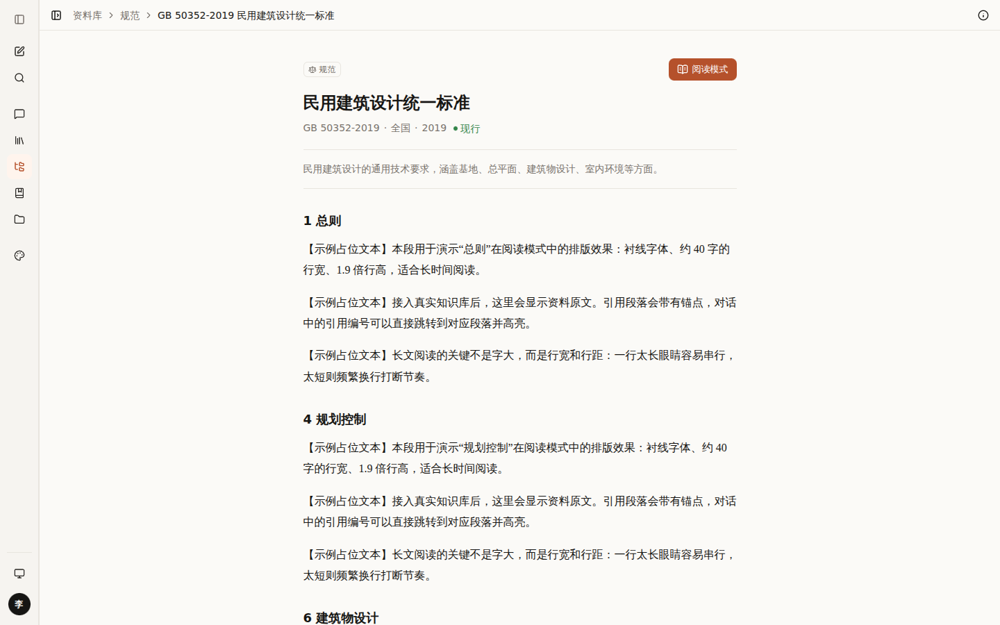 | 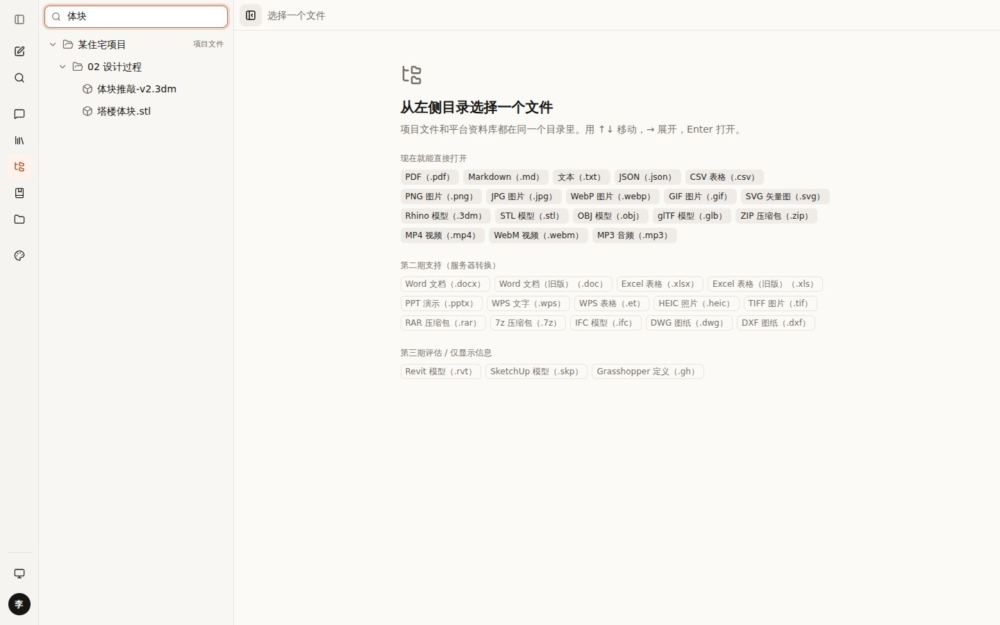 | 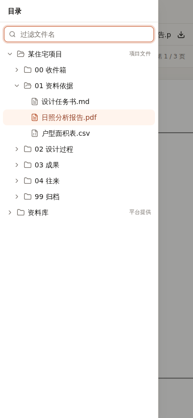 |

## 能打开哪些格式

完整清单见 `/design` 第 9 节（直接读 `src/lib/drive/formats.ts`，和查看器永远一致）。

| 分期 | 格式 | 做法 |
|---|---|---|
| **第一期（已实现，浏览器内完成）** | PDF、图片、Markdown / 文本 / CSV、Rhino 3dm、STL / OBJ / glTF、ZIP、视频音频 | PDF.js、three.js、Rhino 官方 rhino3dm（WebAssembly）、JSZip |
| 第二期（服务器转换） | Word / Excel / PPT / WPS、DWG / DXF 快照、HEIC / TIFF、RAR / 7z、IFC | LibreOffice / OnlyOffice 私有部署、ODA 转换器、libarchive、web-ifc |
| 第三期（评估授权） | DWG 图层 / 测量、Revit、SketchUp | 商业 SDK 或云服务（注意数据出境） |

## 用到的设计知识

- **目录树（Tree View）**：VS Code、Finder、Google Drive 的做法。符合 WAI-ARIA 的 tree 规范：↑↓ 移动、→ 展开、← 收起、Enter 打开，读屏软件能读出层级。
- **可调分栏**：目录宽度可拖（200–480px），一键收起；进入此页时应用侧栏自动收成图标栏——“内容优先，界面让位”。
- **查看器注册表**：格式 → 查看器，和对话里的“内容块注册表”同一个思路。新增格式 = 登记一行 + 注册一个组件。
- **逐级降级（Graceful Degradation）**：能完整看就完整看 → 不能的给快照 → 再不行给说明 + 下载，永远不给空白页。
- **按需加载**：PDF.js、three.js 体积大，只有打开这类文件时才下载；PDF 页面滚动到附近才渲染。
- **URL 即状态**：选中的文件记在 `?f=`，可以分享链接、浏览器后退。
- **建筑师习惯**：三维视图 Z 轴向上（同 Rhino），默认显示黑色边线，看体块更清楚。

## 这次踩到的坑（值得记住）

- **PDF.js 新版用了非常新的 JavaScript 语法**，测试用的浏览器不支持，PDF 打不开。改用它的“兼容版”（legacy build），国内用户浏览器版本偏旧，这一点更重要。
- **国内 Windows 打包的 ZIP，中文文件名是 GBK 编码**，按 UTF-8 读会乱码。现在先试 UTF-8，失败再用 GBK。
- **应用侧栏 + 目录树两栏并排太占地方**：进入文件浏览时应用侧栏自动收起。

## 待你决定

- [ ] “文件浏览”和“我的文件”是否合并成一个入口？A 合并：浏览页里直接拖拽上传、显示传输队列（推荐）/ B 保持两个入口
- [ ] DWG：A 先做 PDF / 图片快照预览（推荐）/ B 直接采购商业 SDK
- [ ] Office 预览：A 服务器私有部署 LibreOffice / OnlyOffice（推荐）/ B 依赖微软在线预览（只适合 OneDrive 里的文件）
- [ ] 是否需要在 PDF / 图纸上**画圈批注**，并存进笔记本？A 需要 / B 暂不需要

## 改动位置

`src/lib/drive/*`、`src/components/drive/*`、`src/app/(app)/browse`、`scripts/copy-vendor.mjs`、`public/samples/drive`（示例文件）
