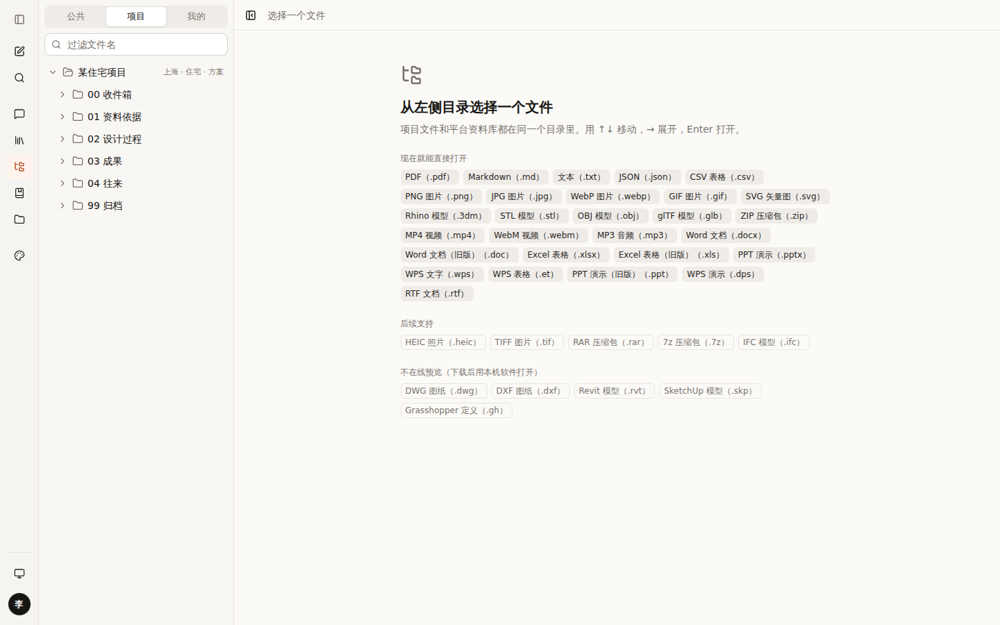
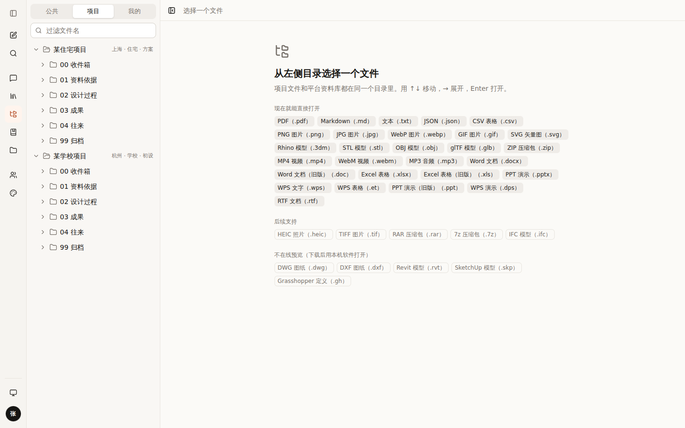
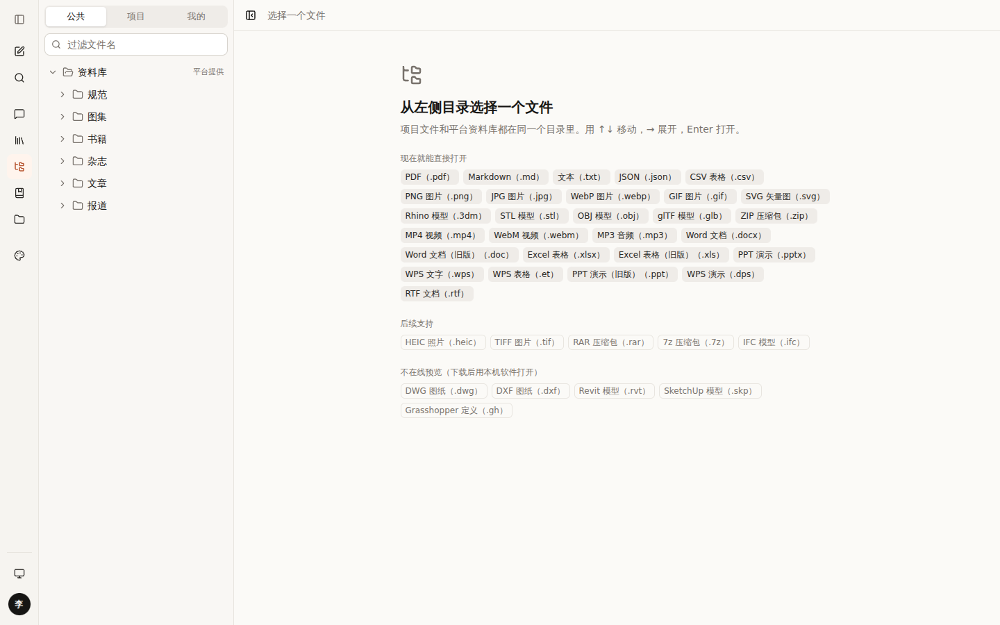
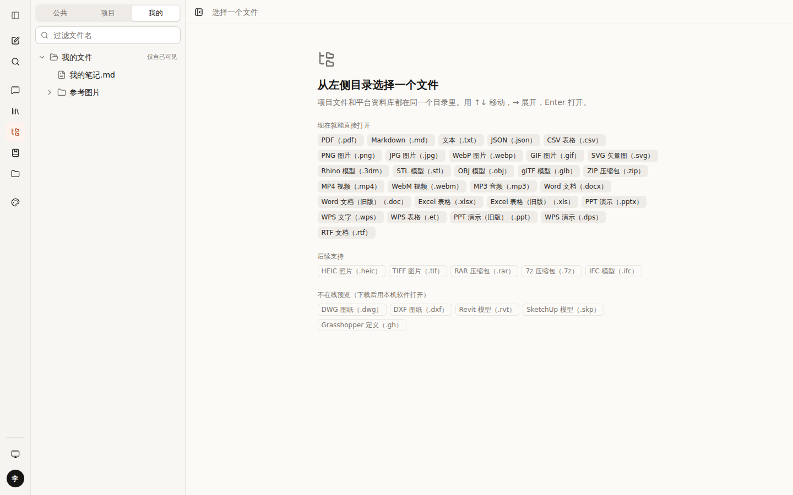
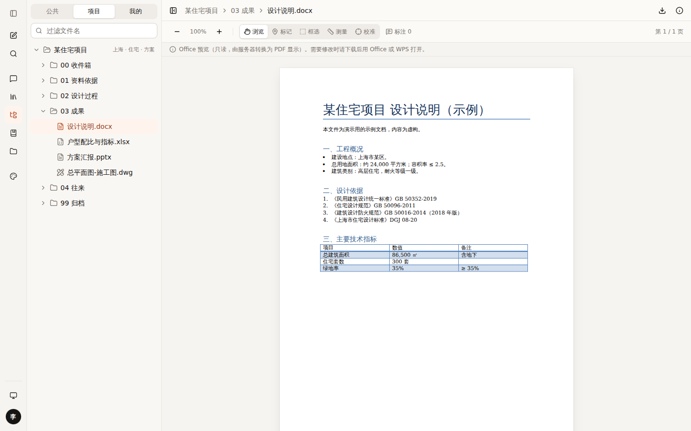
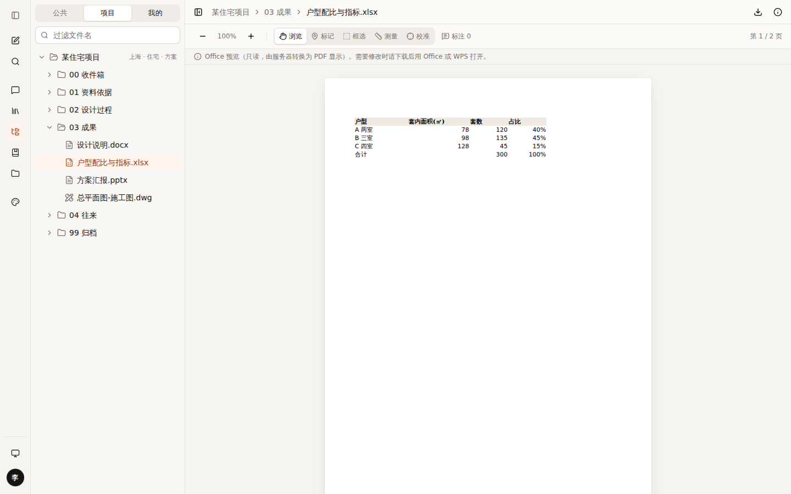
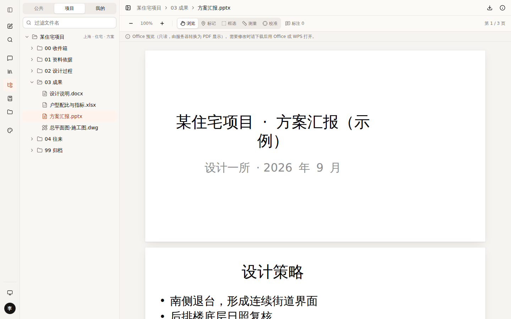
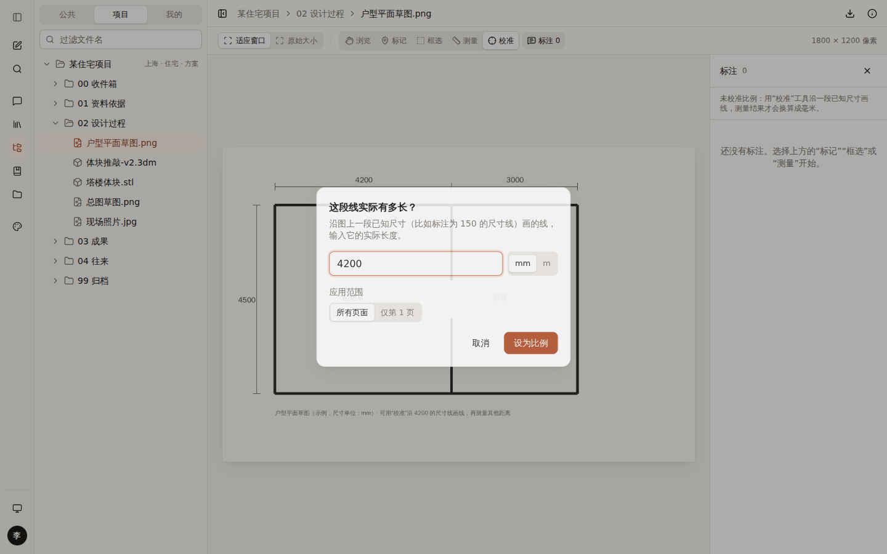
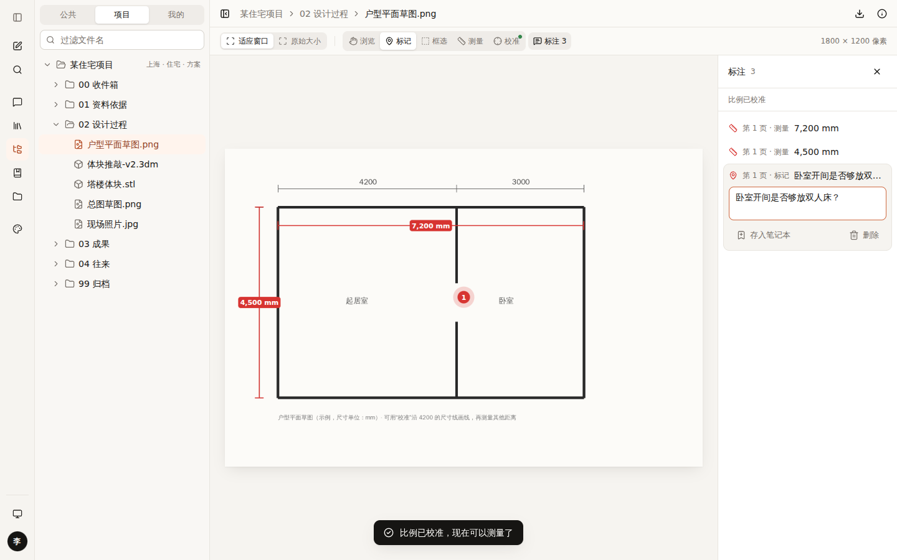
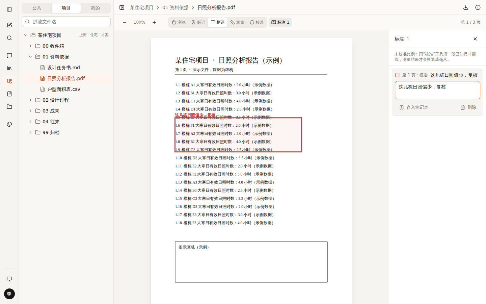

# 008 三个空间、Office 预览、标注与测量

## 已定下来的

| 项 | 决定 |
|---|---|
| 文件浏览的结构 | **公共 / 项目 / 我的** 三个空间，按权限显示（“我的文件”上传页仍是单独的功能） |
| Office | **现在就能打开**（Word / Excel / PPT / WPS），只读即可；服务器用 LibreOffice 转成 PDF |
| DWG | 不做在线预览，下载后用本机 CAD 打开 |
| 标注 | 很重要：PDF、图片、Office 都能标记、框选；**校准比例后可以量尺寸** |
| 邮件服务 | **Resend** |

## 1. 三个空间

| 李娜（只参与住宅项目） | 管理员（看到全部项目） | 公共 | 我的 |
|---|---|---|---|
|  |  |  |  |

- 目录树顶部的分段切换：公共 · 项目 · 我的。
- **能看到哪些项目由服务端决定**（项目成员才能看，管理员看全部），页面只负责显示。
- 项目根目录旁显示项目属性（上海 · 住宅 · 方案）——以后“项目模式”会把它们自动变成检索条件。

## 2. Office 预览

| Word | Excel | PPT |
|---|---|---|
|  |  |  |

```
浏览器 ──文件内容──▶ 我们的服务器（LibreOffice）──PDF──▶ 浏览器用 PDF 查看器显示（同样可以标注）
                     └ 按文件内容指纹缓存：同一个文件只转换一次（演示中第一次约 2 秒，之后约 1 秒）
```

- 只读。页面顶部写明“需要修改时请下载后用 Office 或 WPS 打开”。
- 服务器要装：LibreOffice（writer / calc / impress）+ **中文字体**，否则会乱码或版式错位。

## 3. 标注与测量

| 校准：沿 4200 的尺寸线画线，输入 4200 | 再测量：7,200 mm、4,500 mm，加一个标记 | PDF 上框选 + 批注 |
|---|---|---|
|  |  |  |

工具（快捷键）：浏览 V · 标记 P · 框选 R · 测量 M · 校准 C · Esc 回到浏览 · Delete 删除选中 · 按住 Shift 画水平 / 垂直线

**校准怎么算**：你沿图上一段已知尺寸画线（比如标注 150 的那段），输入 150 mm，系统就知道“屏幕上这么长 = 150 mm”，之后所有测量按这个比例换算。PDF 还能反推出图纸比例（如“约 1:100”）。

## 用到的设计知识

- **分段切换空间**：空间只有 3 个且互斥，用分段控件一眼看全（Apple HIG）；项目多了以后，项目空间里用文件夹列出。
- **工具模式（Modal Tools）**：同一时间只有一个工具生效，当前工具高亮——Figma、Bluebeam、CAD 都是这样。每个工具都有单字母快捷键，熟练后不用找按钮。
- **测量的可信度**：没校准时明确显示“（未校准）”，不给看起来像真的假数字。
- **批注专用色**：`--markup` 红色沿用“红笔改图”的习惯，和强调色（陶土色）、错误色（destructive）分开。
- **缩放不变的标注**：标注存的是“页面坐标”，放大缩小、换屏幕都不会跑位；线宽和字号按当前缩放换算，始终清晰。
- **先稳定画面再画**：选中工具时就打开右侧列表，避免画完第一笔后画面突然变窄。

## 这次修掉的问题

- 文件浏览页在桌面和手机两套布局里各渲染了一份内容，导致文件加载两次、快捷键触发两次。改为只渲染一份。
- 最初测试时 LibreOffice 只装了核心部分，打不开任何文件；补装 writer / calc / impress 后正常。部署清单里要写全。

## 待你决定

- [ ] 标注是只有自己能看，还是项目成员共享？A 项目文件上的标注项目成员共享，个人文件上的只有自己（推荐）/ B 全部只有自己
- [ ] 是否需要“面积测量”（框出一块区域算面积）？A 需要 / B 暂不需要
- [ ] 标注导出：A 导出成带批注的 PDF，发给别人（推荐，后续做）/ B 只在平台里看

## 改动位置

`src/components/drive/annotate/*`、`src/lib/drive/annotations.ts`、`src/components/drive/viewers/{office,pdf,image}-viewer.tsx`、
`src/lib/server/office-convert.ts`、`src/app/api/preview/office`、`src/lib/drive/{projects,sample-tree}.ts`、`src/lib/server/email.ts`
