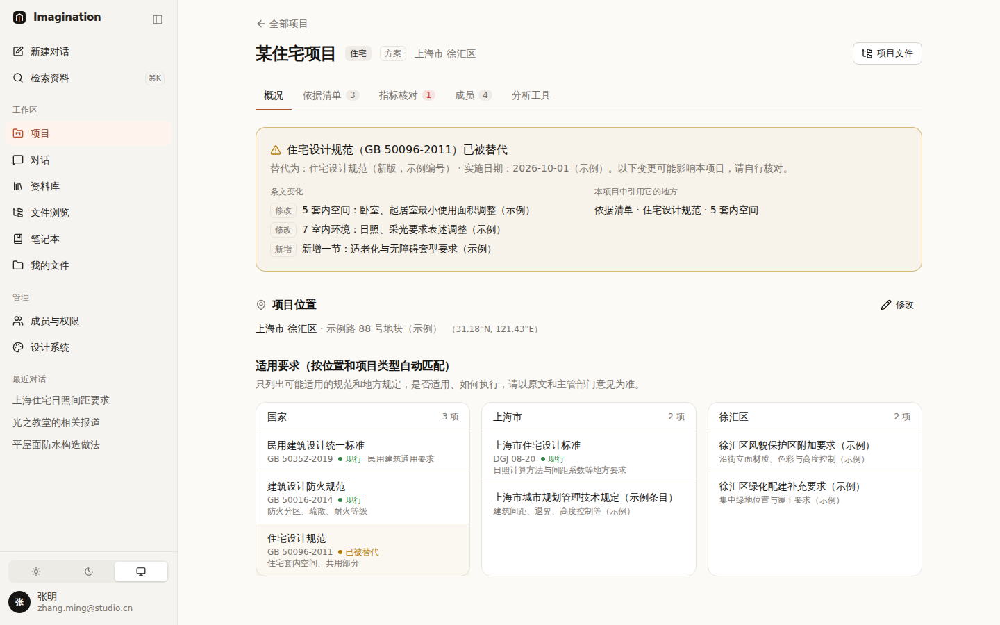
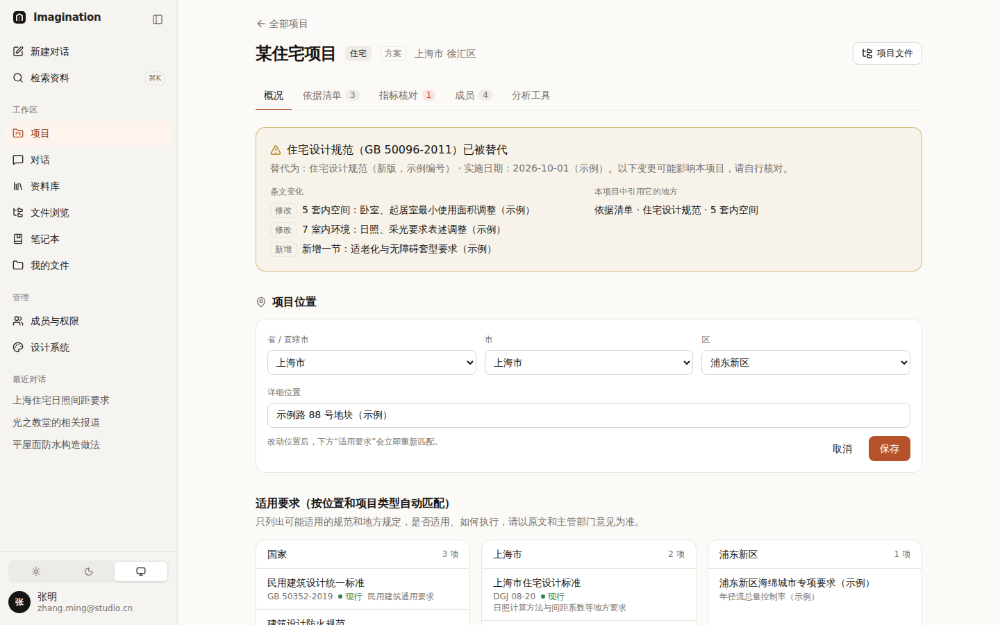
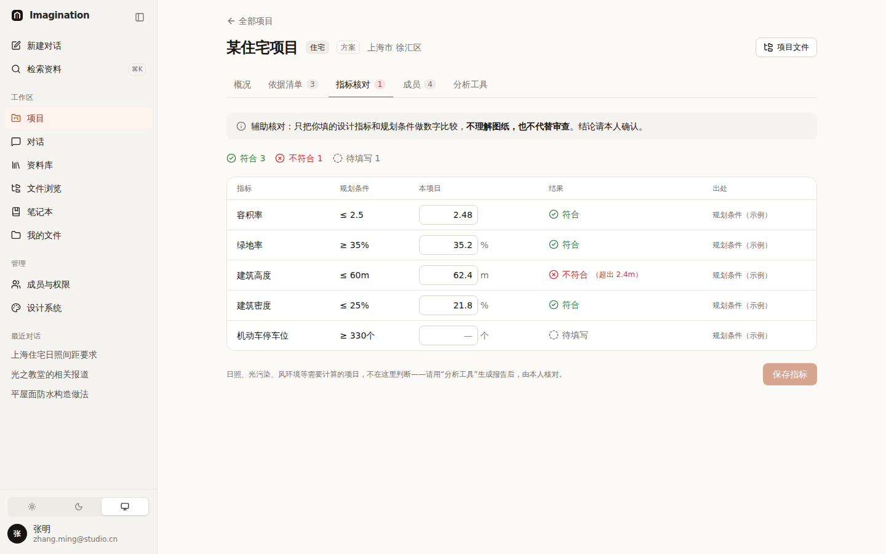
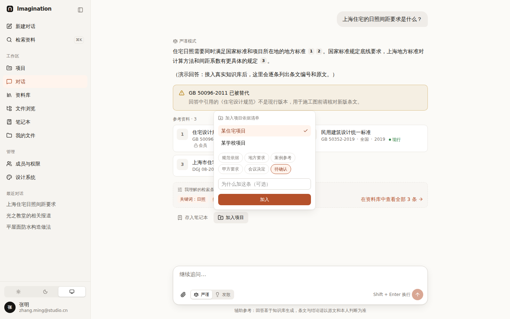
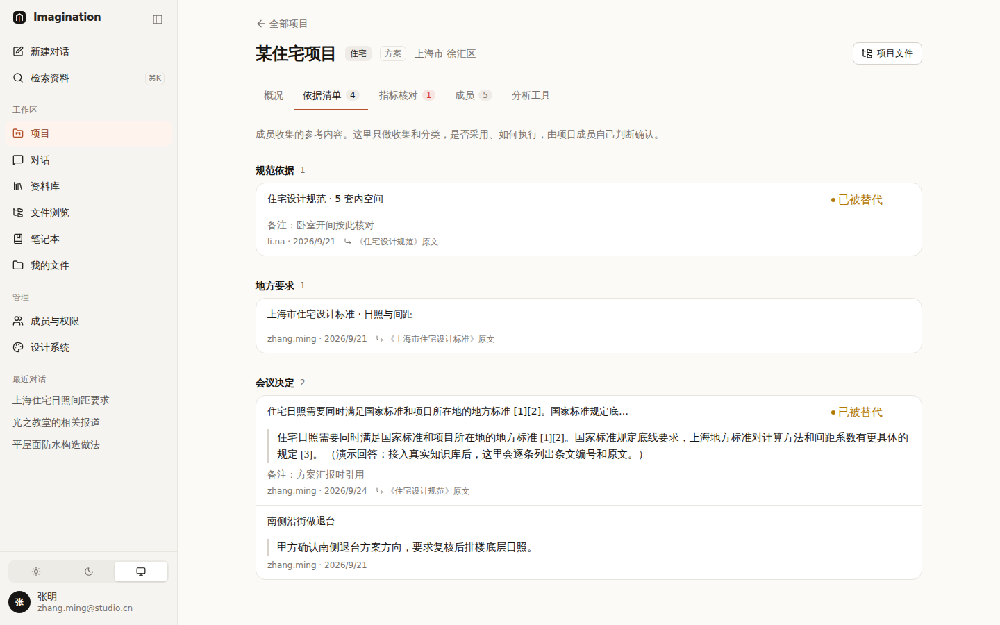
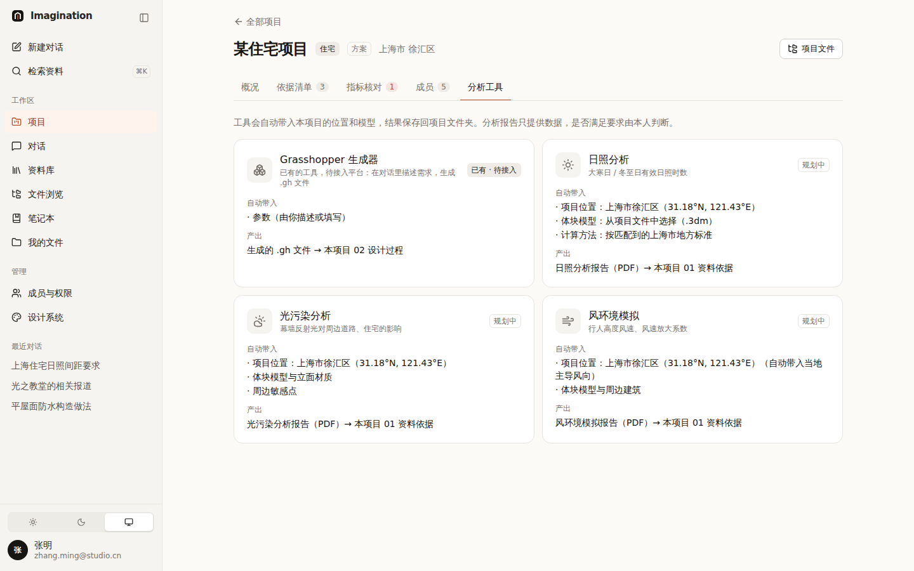
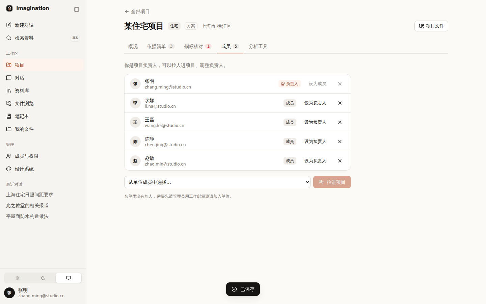
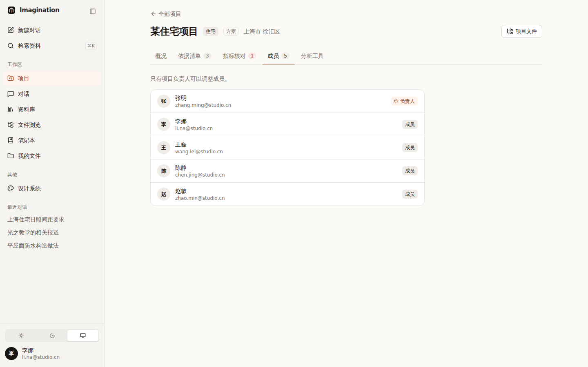

# 009 项目模式

## 已定下来的

| 项 | 决定 |
|---|---|
| 平台定位 | **辅助工具**，不做规范审查、不当审核方；具体确认由本人完成 |
| 机械核对 | 有意义：把指标和条件做数字对比，但必须写明“辅助核对，不代替审查” |
| 规范被替代 | **一定要标出来**，并说清楚改了哪些条文、影响本项目哪些地方 |
| 项目位置 | 录入到区（及详细位置）；录入后国家 / 省市 / 区三级要求**自动匹配** |
| 知识沉淀 | **不做**（没人维护，也做不到那么复杂） |
| 项目成员 | **项目负责人**从单位成员里拉人 |
| 工具 | 目前只有 Grasshopper 生成器；后续：日照、光污染、风环境 |

## 方案

```
项目页 = 概况 · 依据清单 · 指标核对 · 成员 · 分析工具

概况：   位置（省 / 市 / 区 / 详细位置）──自动匹配──▶ 国家 │ 上海市 │ 徐汇区 三栏适用要求
         规范被替代 ──▶ 条文变化 + 本项目中引用它的地方（依据清单、笔记本）
依据清单：对话 / 资料预览 / 阅读选中文字 ──「加入项目」──▶ 按分类收集（只收集，不审核）
指标核对：设计指标 vs 规划条件，逐条数字比较：符合 / 不符合（差多少）/ 待填写
成员：   负责人拉人、设负责人；被拉进来的人才能在“文件浏览 · 项目”里看到文件
分析工具：自动带入项目位置和模型，结果存回项目文件夹
```

| 概况：规范变更 + 三级要求 | 改到浦东新区，区级要求立即重新匹配 | 指标核对（辅助） |
|---|---|---|
|  |  |  |

| 对话里“加入项目” | 依据清单（按分类） | 分析工具 |
|---|---|---|
|  |  |  |

| 负责人管理成员 | 普通成员：只能看 |
|---|---|
|  |  |

## 用到的设计知识

- **措辞体现定位**：“适用要求”写“只列出可能适用的……以原文和主管部门意见为准”；核对页顶部写明“不理解图纸、不代替审查”；清单写“只收集，不审核”。界面用词就是产品的承诺。
- **警示放最上面**：规范被替代是必须看到的信息，放在概况页第一屏，用警示色 + 图标 + 文字（不只靠颜色）。
- **影响范围分析（Impact Analysis）**：不只说“它变了”，还列出“变了什么”和“你在哪里用到了它”，用户可以逐条去核对。
- **即时反馈**：改位置时，下方匹配结果立刻变化，保存前就能看到后果。
- **数字对比说清差多少**：“不符合（超出 2.4 m）”比单纯一个红叉更有用。
- **下划线式标签页（Tabs）**：项目内的几个方面是平级的，用标签切换；带计数（依据 4、不符合 1）让人不用点进去就知道状态。
- **权限在服务端**：负责人才能改；普通成员界面上看不到编辑按钮，直接调接口也会被拒绝（403）。

## 演示数据说明

- 区级、省市级要求中标“示例”的条目，以及“新版规范编号”“条文变化”，均为**虚构**，仅演示界面。
- 规划条件、设计指标为示例项目数据。

## 待你决定

- [ ] 新建项目由谁发起？A 管理员建项目并指定负责人（推荐）/ B 任何成员都能建，自己当负责人
- [ ] 依据清单是否需要“已采用 / 不采用”的状态？A 需要，负责人标记（推荐）/ B 不需要
- [ ] 规划条件从哪来？A 负责人手动录入（现在的做法）/ B 上传规划条件 PDF 后由 AI 提取，本人确认
- [ ] 对话时是否默认带上当前项目（自动按项目位置检索）？A 是（推荐）/ B 每次手动选

## 改动位置

`src/lib/projects/*`、`src/lib/server/projects.ts`、`src/app/api/projects/[id]`、`src/components/projects/*`、
`src/app/(app)/projects/**`、`src/components/account/account-boundary.tsx`（阅读模式也能拿到账户与项目）
