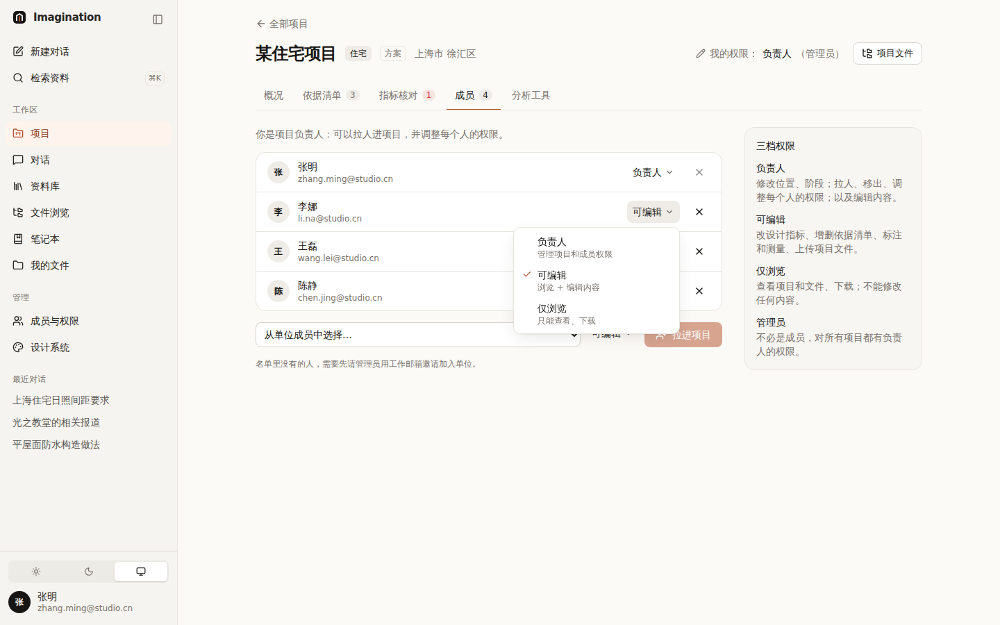
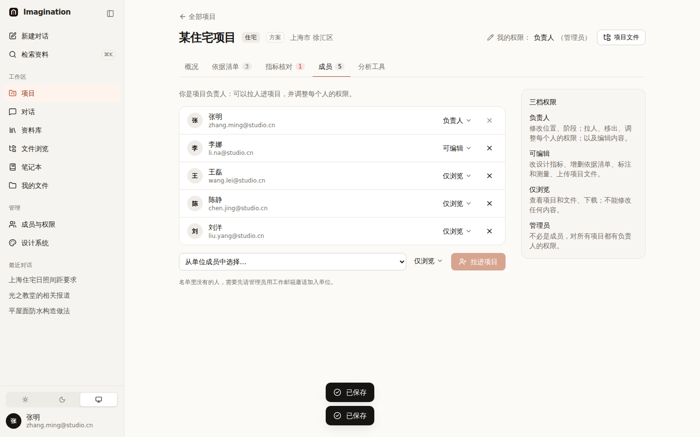
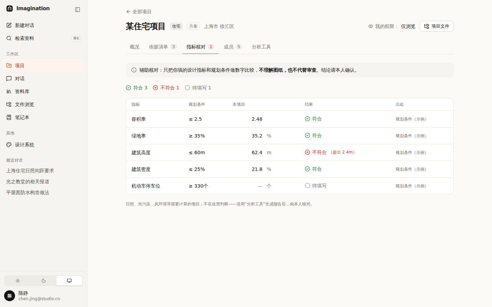
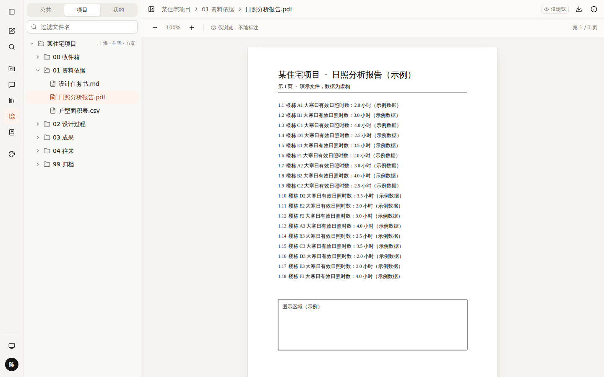
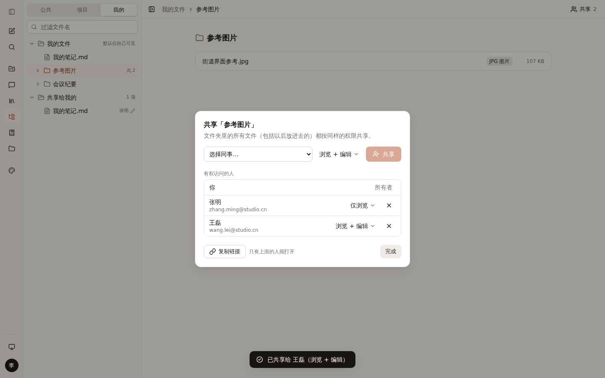
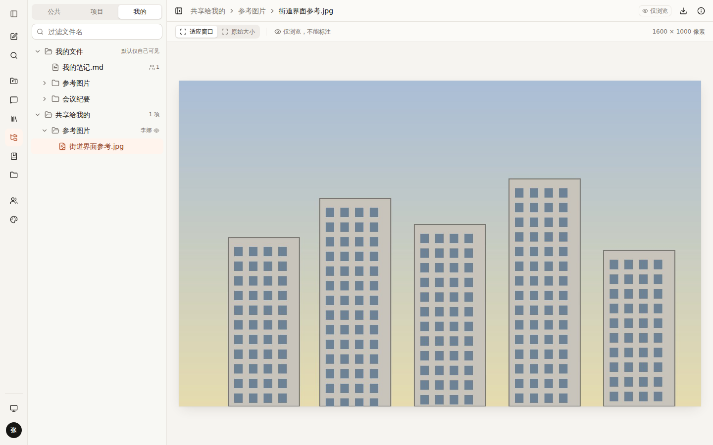
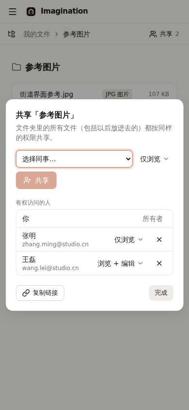

# 010 权限：项目三档角色 + 个人文件共享

## 已定下来的

| 项 | 决定 |
|---|---|
| 管理员 | **全部权限**：不必是项目成员，也能管理任何项目的信息和成员 |
| 项目负责人 | 管理项目（位置、阶段），**也管理项目里每个人的权限** |
| 项目成员 | 两档：**仅浏览** / **浏览 + 编辑** |
| 个人文件夹 | **和项目同一套逻辑**：主人可以把文件 / 文件夹共享给同事，同样分“仅浏览”和“浏览 + 编辑” |

## 方案

一套词，用在两个地方：

```
            看、下载   标注 / 测量 / 改指标 / 加依据   改信息 / 调权限
仅浏览        ✓              ✗                          ✗
浏览 + 编辑   ✓              ✓                          ✗
负责人 / 主人  ✓              ✓                          ✓
管理员        ✓              ✓                          ✓（所有项目）
```

- **项目**：负责人在“成员”标签里给每个人选档位；项目至少要有一位负责人（最后一位负责人不能降级、不能移出）。
- **个人文件**：在“文件浏览 · 我的”里选中自己的文件或文件夹 → 右上角「共享」→ 选同事 + 档位。共享文件夹 = 里面所有文件（包括以后放进去的）都按同样的档位共享。
- 对方在“我的 · 共享给我的”里看到，旁边标出主人和档位（👁 仅浏览 / ✎ 可编辑）。
- **仅浏览时**：查看器的标注工具换成“仅浏览，不能标注”，顶栏有“仅浏览”标记；“加入项目”只列出你能编辑的项目。
- **服务端校验**：接口按改动内容分级（只改指标 → 需要“编辑”；位置、阶段、成员 → 需要“管理”）；共享只能由主人发起、修改、取消（管理员可以取消）。界面隐藏按钮只是为了好用，不是安全措施。

| 负责人改某人的档位 | 改完：王磊、刘洋为仅浏览 | 最后一位负责人不能降级 |
|---|---|---|
|  |  |  |

| 仅浏览成员：指标不能改 | 仅浏览成员：PDF 没有标注工具 |
|---|---|
|  |  |

| 共享面板（桌面） | 收到共享的人：仅浏览 | 共享面板（手机） |
|---|---|---|
|  |  |  |

## 用到的设计知识

- **RBAC（基于角色的权限）**：先定几个角色，再把人放进角色，而不是给每个人单独勾选几十项。Google Drive、Figma、飞书、Notion 都是“查看 / 编辑 / 管理”这几档。
- **一致性（Jakob 定律）**：用户把在别处学到的习惯带过来。项目和个人共享用**同一套词、同一个下拉**，学一次两处通用。
- **可见的后果（Recognition over recall）**：下拉里每档都带一句“能做什么”，选之前就知道结果，不用记。
- **防错（Poka-yoke）**：最后一位负责人的“降级 / 移出”直接禁用并说明原因，比点了再报错好。
- **最小权限原则**：新拉进项目默认“可编辑”（大多数人要干活），共享个人文件默认“仅浏览”（个人资料更谨慎）。
- **立即保存**：共享面板里每次改动直接生效，不需要再点“保存”（Google Drive 的做法），出错就提示并保持原样。
- **一屏一个主操作**：共享面板里主色只给“共享”，“完成”用次要按钮。

## 备选方案与取舍

| 方案 | 优点 | 缺点 | 结论 |
|---|---|---|---|
| 三档角色（负责人 / 可编辑 / 仅浏览） | 简单、和常见产品一致 | 不能细到“能标注但不能改指标” | **采用** |
| 每人逐项勾选权限 | 最灵活 | 负责人要勾很多项，容易出错，也难核对 | 不采用（单位级的功能权限已经在“成员与权限”里） |
| 个人共享只给“仅浏览” | 更安全 | 协作改同一份文件做不到 | 不采用（需求是两档） |
| 共享给“链接持有人” | 方便转发 | 链接泄露就失控；与邀请制冲突 | 不采用：链接只对有权限的人有效 |

## 待你决定

- [ ] **管理员能不能看别人的“我的”文件？** A 不能看，只能收回共享（例如离职时） / B 能看全部 / C 能看，但每次查看留记录。推荐 **A**：“我的”是私人空间，管理员全权主要体现在项目和账号上；真需要时由本人共享或走 C。
- [ ] **仅浏览的人能不能用“测量”？** A 不能（现在的做法） / B 能测量但不保存、不能标注。推荐 **B**：量尺寸不改变任何东西，看图的人也常需要。
- [ ] **有人离开项目或离职时，他共享出去的个人文件怎么办？** A 共享自动失效 / B 转给项目负责人或管理员。推荐 **A**，重要资料应该放在项目文件夹而不是个人文件夹。

## 改动位置

- `src/lib/access.ts`：档位（仅浏览 / 浏览 + 编辑）
- `src/lib/projects/types.ts`：`MemberRole = lead | editor | viewer`、`MEMBER_ROLES`、`ProjectAccess`
- `src/lib/server/projects.ts`：`canEditContent` / `canManage` / `accessOf` / `patchNeeds`；`api/projects/[id]` 按改动分级校验
- `src/lib/server/shares.ts` + `src/app/api/shares/route.ts`：个人共享（只有主人能发起，管理员可以收回）
- `src/lib/drive/sample-tree.ts`：每人一棵“我的”（`me/邮箱/…`）+ “共享给我的”
- `src/components/share/`：`AccessMenu`（`RoleSelect`、`LevelSelect`）、`ShareDialog`
- `src/components/projects/members-tab.tsx`、`project-view.tsx`、`refs-tab.tsx`、`add-to-project.tsx`
- `src/components/drive/drive-view.tsx`、`file-tree.tsx`、`viewer-host.tsx`、`annotate/annotator.tsx`（`readOnly`）
- `/design` 样张页第 11 节
