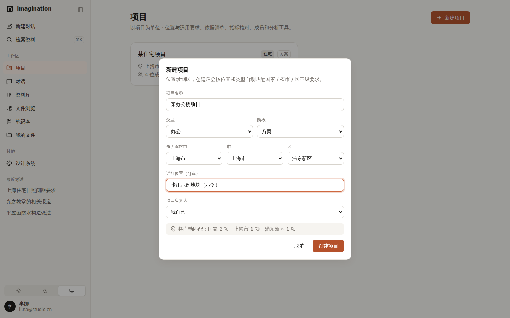
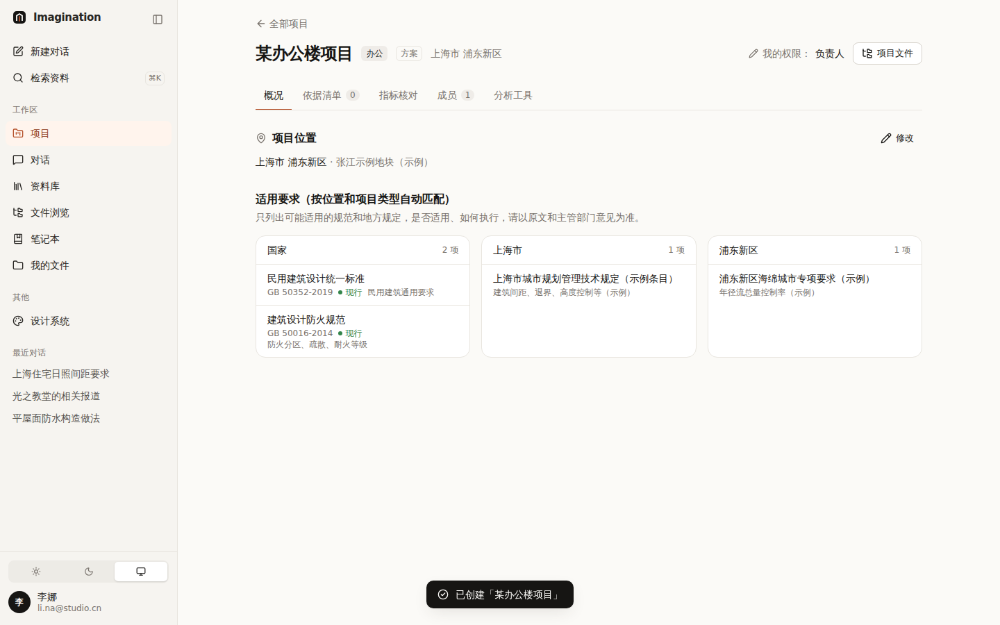
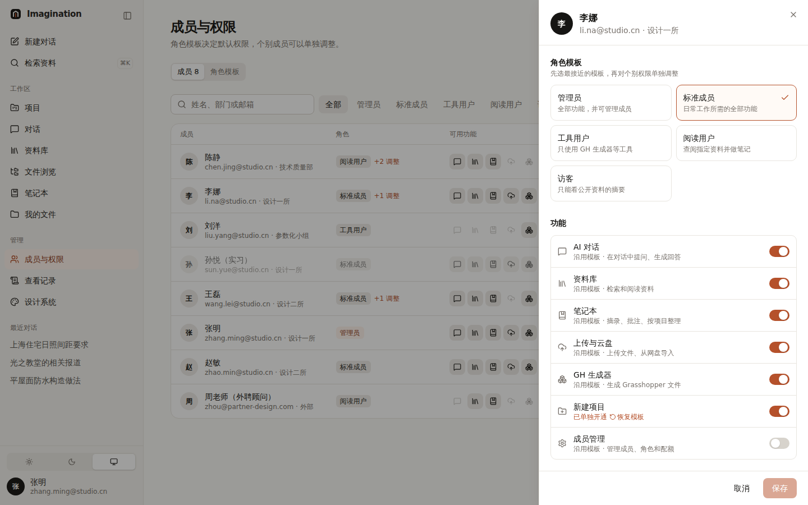
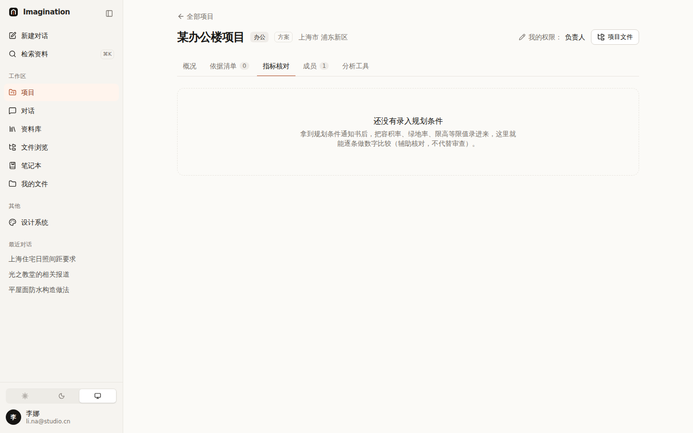

# 012 新建项目

## 已定下来的

| 项 | 决定 |
|---|---|
| 谁能新建项目 | **管理员 + 管理员指定的人** |

## 方案

- “新建项目”是一项**功能权限**，和“AI 对话”“上传”等并列：管理员自带；其他人由管理员在「成员与权限」里单独打开（示例：李娜）。没有权限的人看不到按钮，接口也会拒绝。
- 新建时填：名称、类型、阶段、省 / 市 / 区、详细位置、**项目负责人**（默认自己，也可以指定别人）。
  - 指定别人当负责人时：发起人如果不是管理员，自动作为“可编辑”成员加入。
- **即时反馈**：选好位置和类型，对话框底部马上显示“将自动匹配 国家 2 项 · 上海市 1 项 · 浦东新区 1 项”。
- 创建后直接进入项目概况；文件浏览里自动出现这个项目的标准文件夹（00 收件箱 … 99 归档）。
- 同名项目不允许（避免混淆）。
- 新项目还没有规划条件：“指标核对”显示空状态，说明录入后能做什么。

| 新建对话框 | 创建后：三级要求已匹配 |
|---|---|
|  |  |

| 管理员给某人打开“新建项目” | 新项目的“指标核对”空状态 |
|---|---|
|  |  |

## 用到的设计知识

- **即时反馈（Feedback）**：操作的结果马上可见（Nielsen 原则 1）。位置一选好就告诉你会匹配到什么，用户在创建之前就能确认位置选对了。
- **合理默认值**：负责人默认是自己、类型和阶段默认第一项，最常见的情况只需要填名称和位置（Hick 定律：选择越少，决定越快）。
- **空状态**：没有数据的页面不留白，而是说明“这里将会有什么、怎么让它出现”。

## 备选方案与取舍

| 方案 | 结论 |
|---|---|
| 单独做一个“项目创建人”角色 | 不采用：功能权限已经能单独开关，不必多一个角色 |
| 创建向导（分好几步） | 不采用：字段不多，一个对话框更快；以后加规划条件时再考虑分步 |

## 待你决定

- [ ] **规划条件怎么录入？**（之前未定）A 手动逐条填 / B 上传规划条件通知书 PDF，自动识别后本人核对 / C 先 A，接入 AI 后加 B。推荐 **C**。
- [ ] **项目能不能删除？** A 不能删，只能“归档”（从列表隐藏，数据保留） / B 管理员可以删除。推荐 **A**，和“历史版本永久保留”一致。

## 改动位置

- `src/lib/auth/permissions.ts`：新功能 `project_create`
- `src/lib/server/projects.ts`：`createProject`；`src/app/api/projects/route.ts`
- `src/components/projects/new-project.tsx`；`src/app/(app)/projects/page.tsx`；`checks-tab.tsx` 空状态
