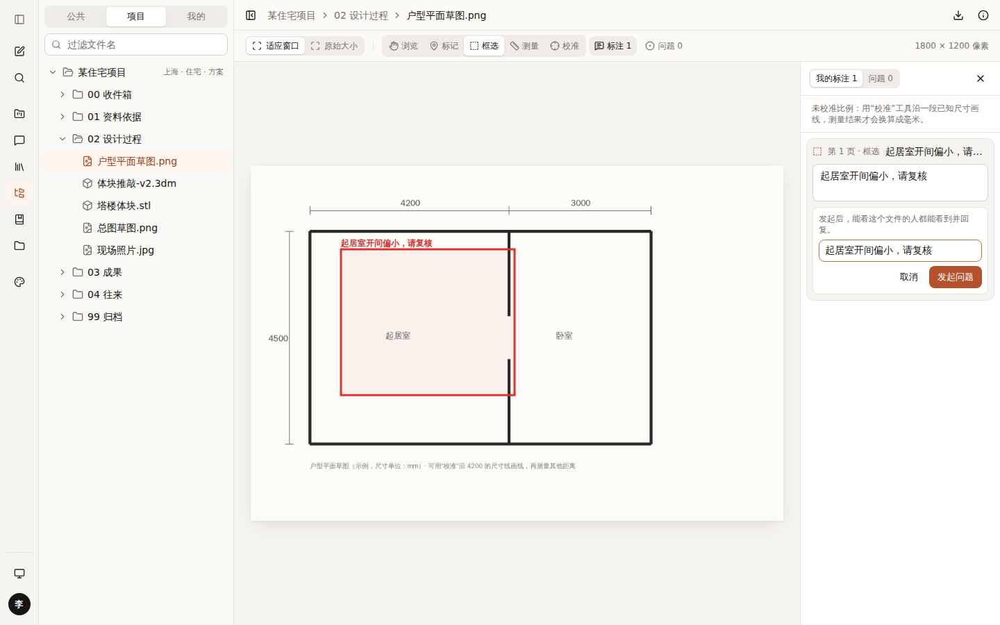
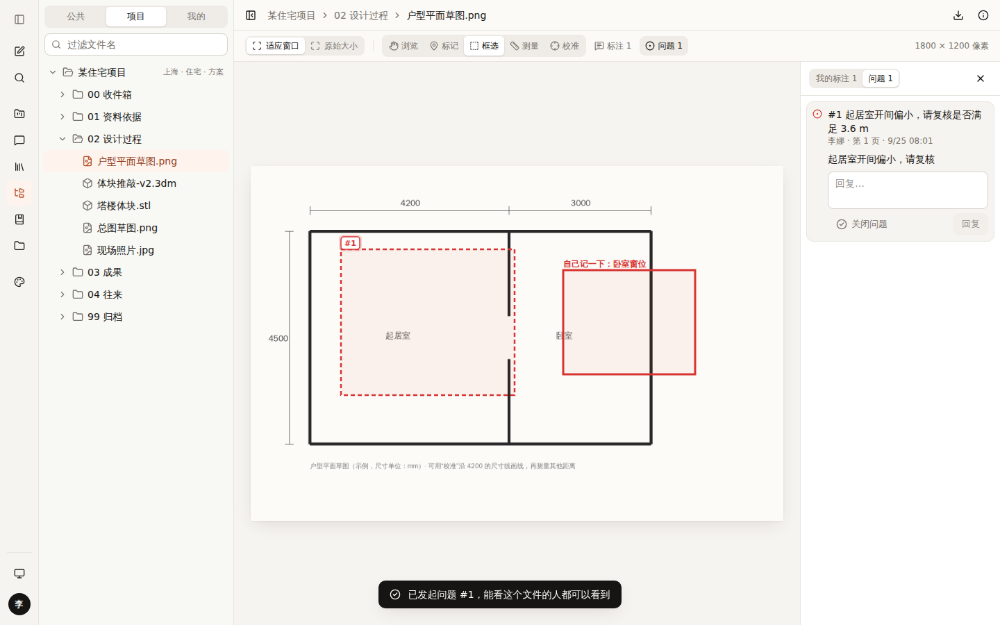
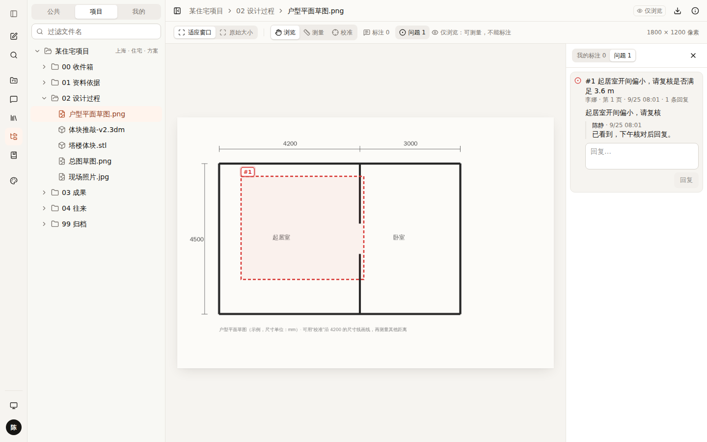
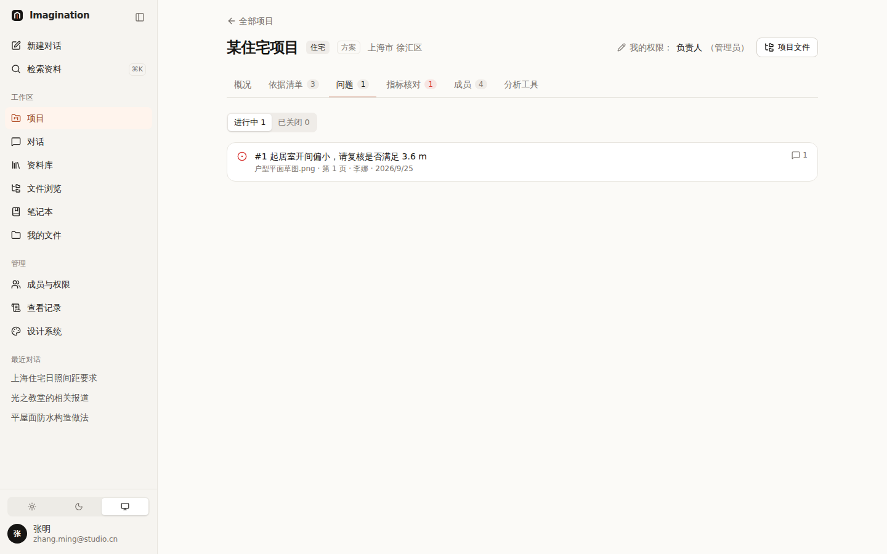
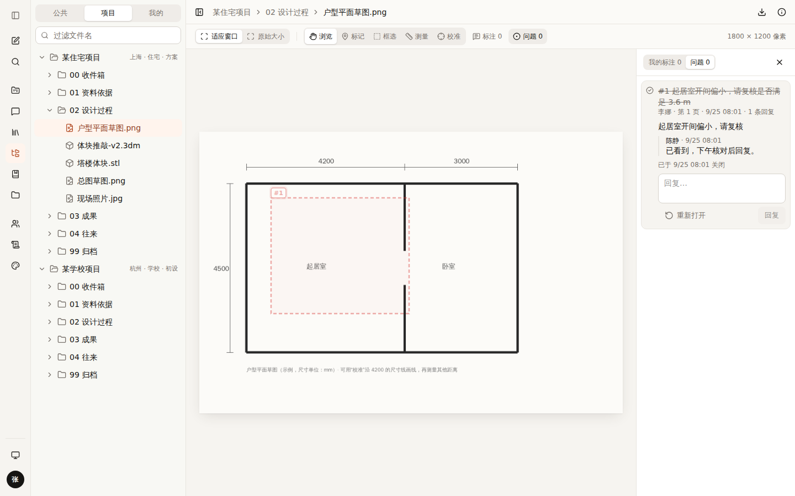

# 013 问题（Issue）：标注平时自己看，想给别人看就发起问题

## 已定下来的

| 项 | 决定 |
|---|---|
| 标注给谁看 | **平时只有自己看**；想让别人看，就把这条标注**发起为问题** |

## 方案

```
我的标注（实线，只有自己看得到）
      │ 选中 → 「发起问题」→ 写一句说明
      ▼
问题 #1（虚线 + “#1”标签，存在服务器）
      ├─ 能看这个文件的人：都看得到，都能回复（包括“仅浏览”）
      ├─ 可编辑以上 / 发起人：可以关闭、重新打开
      └─ 项目页「问题」标签：全项目的问题清单，点一条直接打开图纸并定位
```

- 发起后，这条标注从“我的标注”移到“问题”，不会画两遍。
- 编号按项目统一递增（#1 #2 …），开会时说“#12”大家都知道是哪个。
- 测量类的问题会带上发起人当时的比例，别人看到的长度一样。
- 已关闭的问题在图上变淡，列表里划掉，仍然保留可查。

| 发起问题 | 发起后：问题 #1（虚线）+ 自己的标注（实线） |
|---|---|
|  |  |

| 仅浏览的人：看得到、能回复，不能发起和关闭 | 项目页「问题」标签 | 关闭后 |
|---|---|---|
|  |  |  |

## 用到的设计知识

- **Issue（问题单）**：把“要一起处理的一件事”做成一条有编号、有状态、能讨论的记录。GitHub Issues、Figma 评论、BIM 协同里的 BCF 问题都是这个模式；建筑行业的“图纸会审意见单”也是同一个思路。
- **私人 / 公开两层**：先在私人空间随手画，想清楚了再公开。对应 Figma “草稿 → 发布”的做法，减少大家看到半成品的压力。
- **视觉区分**：同样用批注红（--markup），但私人是实线、问题是虚线加编号标签。只靠颜色区分对色弱的人不友好（WCAG 1.4.1：不要只用颜色传达信息），所以用线型和标签。
- **深链接**：项目页的每一条问题都是一个链接（`?issue=`），点开直接定位到图纸上的位置，也可以发给同事。

## 备选方案与取舍

| 方案 | 结论 |
|---|---|
| 标注直接全员可见 | 不采用：你要求平时自己看 |
| 每条标注单独设“公开 / 私有”开关 | 不采用：开关多了容易误公开；“发起问题”这个动作更明确 |
| 问题指派给某个人、设截止日期 | 暂不做：先看实际用法，需要再加 |

## 待你决定

- [ ] **发起问题后要不要通知？** A 不通知，大家在项目页看 / B 发邮件给项目成员 / C 只通知被 @ 的人。推荐 **C**（需要先做“@某人”），过渡期用 A。
- [ ] **问题要不要指派负责人和截止日期？** A 不要（现在） / B 要。推荐先 **A**，内测时看大家是否需要。
- [ ] **个人标注要不要跟着账号走（换电脑也在）？** A 要：存到服务器，仍然只有自己看得到 / B 不要，留在本机浏览器。推荐 **A**，放进第 ③ 步下一批。

## 改动位置

- `src/lib/drive/issues.ts`（类型）、`src/lib/server/issues.ts`、`src/lib/server/file-access.ts`（按文件判断权限）
- `src/app/api/issues/route.ts`、`src/app/api/issues/[id]/route.ts`
- `src/components/drive/annotate/`：`use-issues.ts`、`issue-layer.tsx`、`issues-panel.tsx`、`marks-panel.tsx`（发起问题）、`annotator.tsx`（两个标签页、`?issue=` 定位）、`annotate-toolbar.tsx`
- `src/components/projects/issues-tab.tsx`；`/design` 第 12 节
