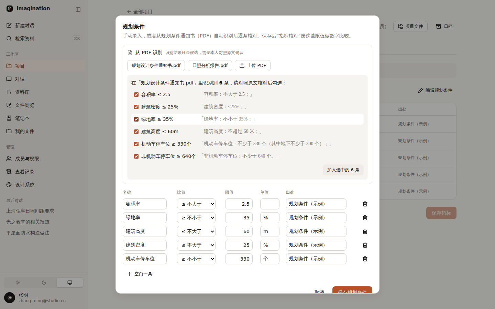
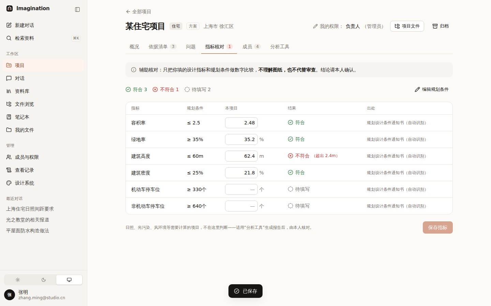
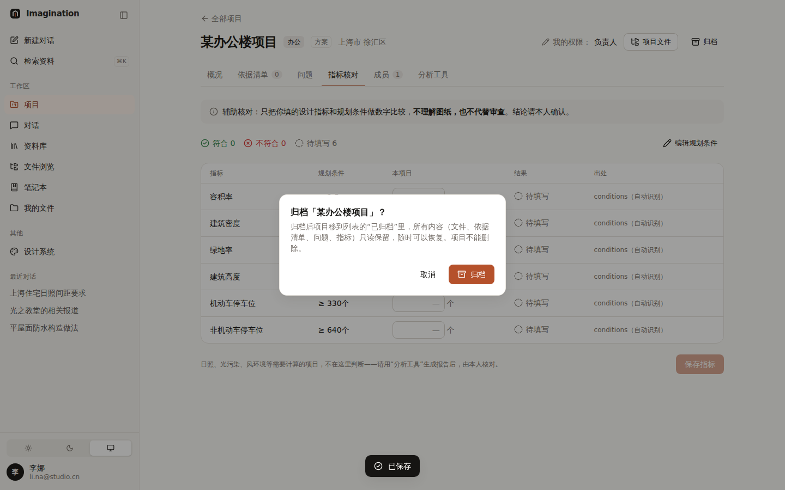
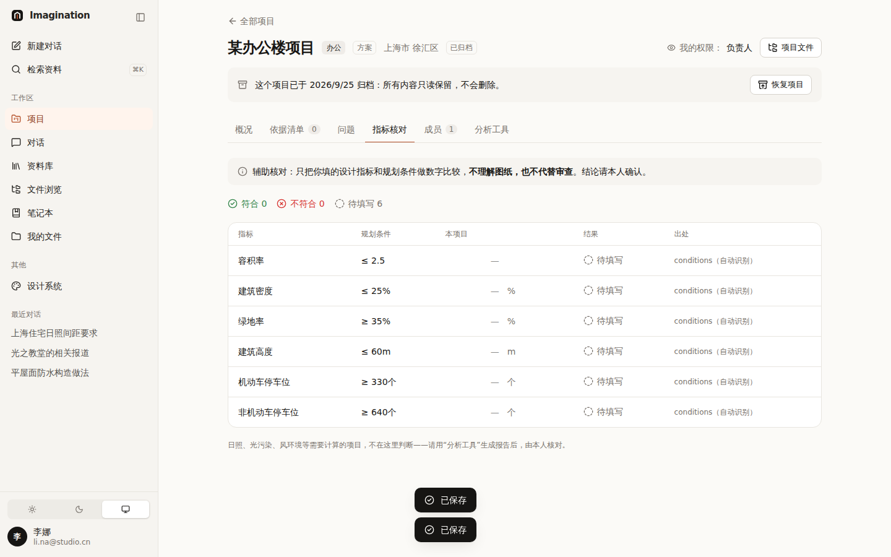
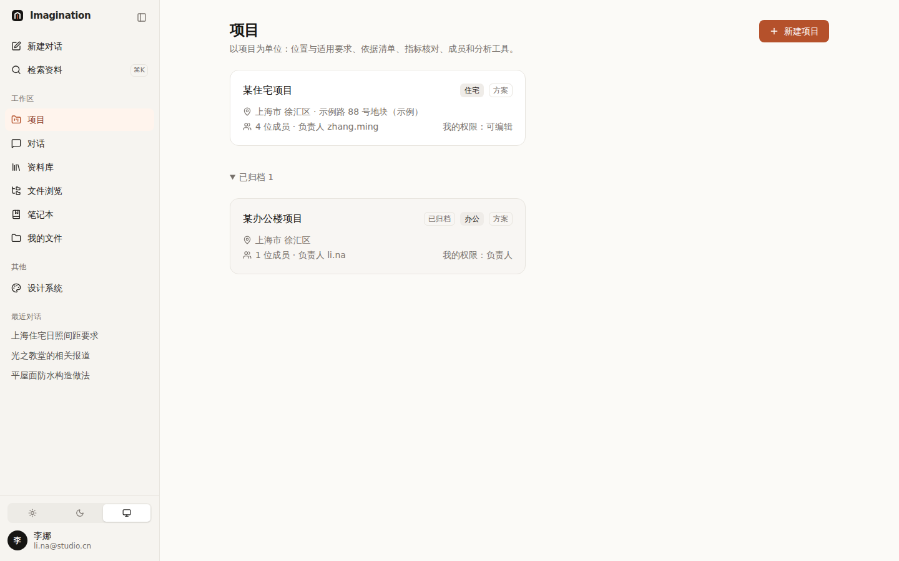
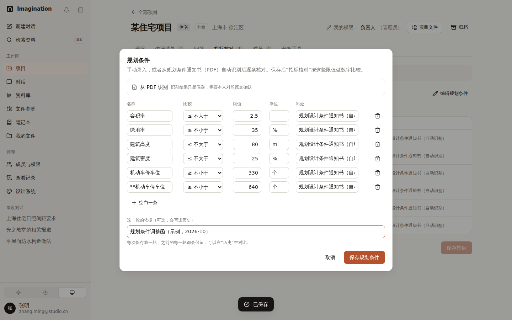
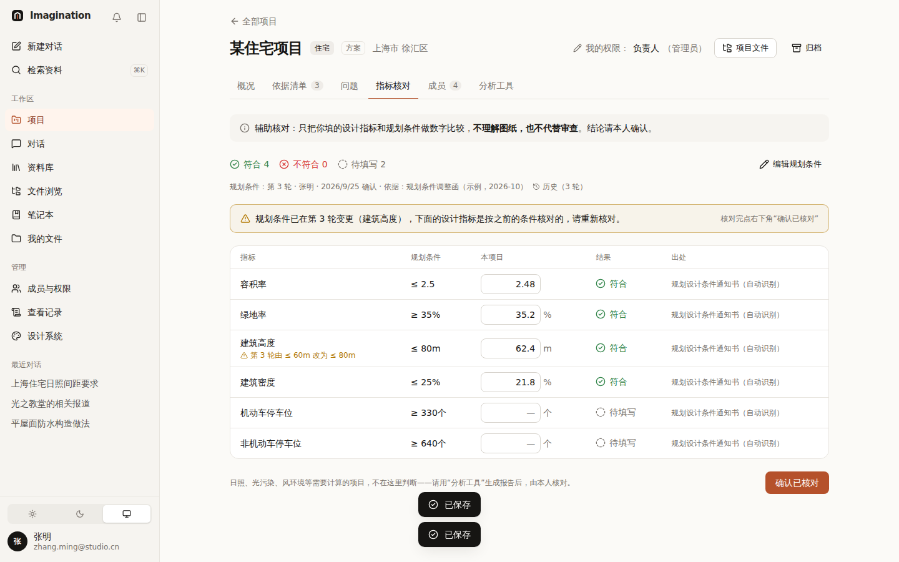
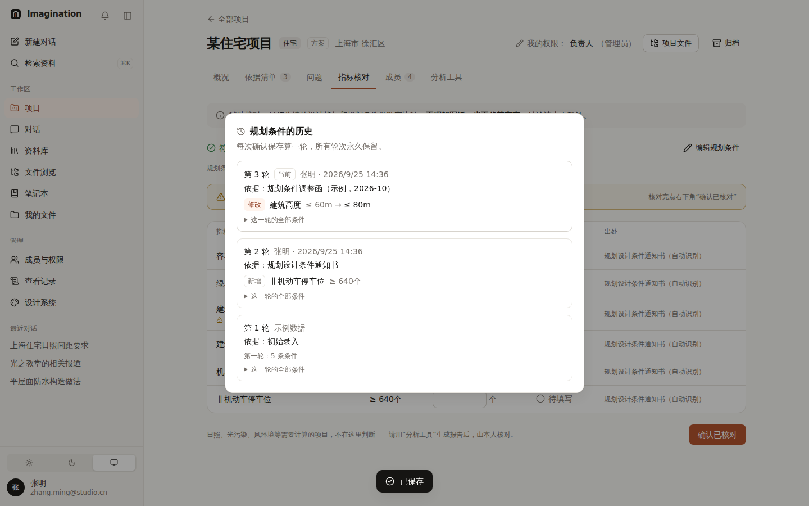
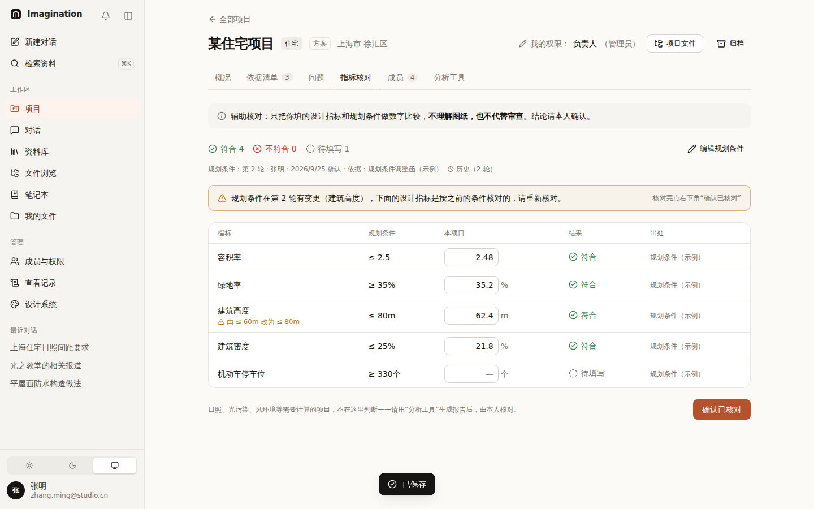
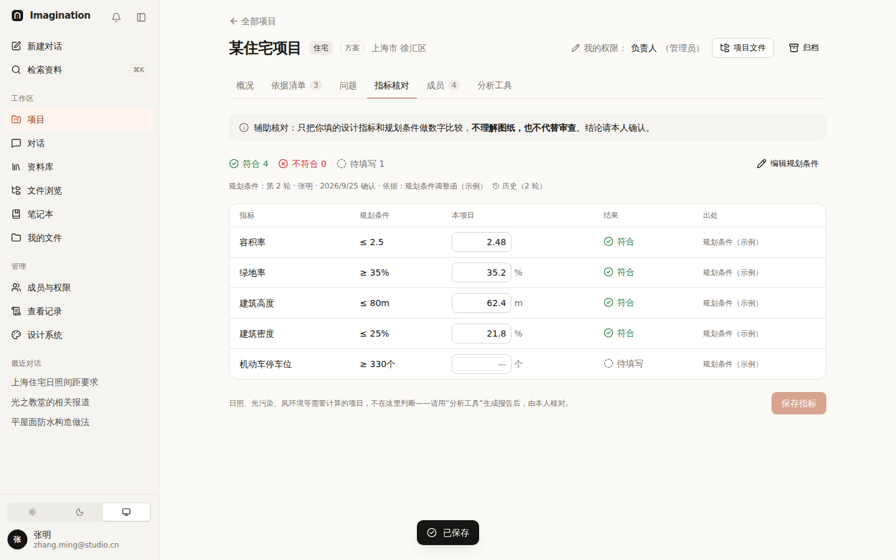

# 014 规划条件录入（手动 + PDF 识别）与项目归档

## 已定下来的

| 项 | 决定 |
|---|---|
| 规划条件怎么录入 | **手动录入 和 上传 PDF 识别 同时存在** |
| 项目能不能删除 | **不能删，只能归档**（只读保留，可以恢复） |

## 规划条件

```
指标核对 → 「编辑规划条件」
   ├─ 从 PDF 识别：选项目里的 PDF，或上传一份
   │     └─ 候选列表：每条都带原文片段「3. 绿地率：不小于 35%；」→ 本人勾选确认
   └─ 手动录入：名称 / 比较 / 限值 / 单位 / 出处；常用指标一键添加
保存 → 指标核对按这些限值逐条比较（辅助核对，不代替审查）
```

- 识别**不用 AI**：按关键词（容积率、建筑密度、绿地率、建筑高度 / 限高、机动车 / 非机动车停车位）和“不大于 / 不小于 / ≤ / ≥”等写法找数字，在浏览器里完成，文件不上传到别处。
- 识别结果**只是候选**：每条旁边显示原文，默认全选但必须点“加入”，最后还要点“保存”——两次确认。
- 扫描件（没有文字层）会明确提示“读不到文字，需要 OCR，接入 AI 后支持，请先手动录入”。
- 有编辑权限的人（负责人 / 可编辑）可以录入。

| 从 PDF 识别：每条带原文 | 保存后：按新条件核对 |
|---|---|
|  |  |

## 项目归档

- 负责人 / 管理员可以归档；归档前有确认说明（“只读保留，随时可以恢复，项目不能删除”）。
- 归档后：顶部横幅说明、所有修改入口隐藏，服务器也拒绝修改；项目列表里移到折叠的“已归档”；文件浏览里标“已归档”；“加入项目”不再列出它。
- 负责人 / 管理员随时可以“恢复项目”。

| 归档确认 | 归档后（只读） | 列表里的“已归档” |
|---|---|---|
|  |  |  |

## 用到的设计知识

- **人在回路（Human-in-the-loop）**：机器给候选，人做决定。自动识别的数字直接进入核对会让人误以为“系统确认过了”，所以每条都要对照原文、由本人确认——和“平台只做辅助”的定位一致。
- **可追溯**：每条条件都记“出处”（手动录入 / 某文件自动识别），核对表里一直能看到。
- **软删除（归档）**：不真正删除，而是隐藏 + 只读。Gmail 的“归档”、GitHub 的“Archive repository”都是这个做法。可以恢复，误操作不致命（Nielsen 原则 3：用户能撤销）。

## 备选方案与取舍

| 方案 | 结论 |
|---|---|
| 识别后直接保存 | 不采用：数字错了没人发现，风险大 |
| 把 PDF 发给 AI 识别 | 暂不做：还没接入 AI；接入后作为增强，仍保留“对照原文确认” |
| 归档后完全隐藏 | 不采用：放在折叠区，查旧项目时还能找到 |

## 待你决定

- [ ] **规划条件改了要不要留历史？** A 不留，只保留最新 / B 每次保存留一个版本，能看到“谁在什么时候把限高从 60 改成 80”。推荐 **B**（和文件“历史版本永久保留”一致），放到下一批。
- [ ] **识别不到的其他指标**（退线、日照、配建）要不要加进规则？A 先不加，等 AI / B 现在按你们常见的通知书写法补几条。推荐 **B**：请提供 2–3 份真实通知书（可脱敏），我照着补。

## 改动位置

- `src/lib/projects/extract-conditions.ts`（识别规则）、`src/lib/drive/pdf-text.ts`（读 PDF 文字）
- `src/components/projects/conditions-editor.tsx`、`checks-tab.tsx`
- `src/lib/server/projects.ts`：`conditions` 校验、`archived`、归档后只读；`api/projects/[id]`、`refs` 接口的归档检查
- `src/components/projects/project-view.tsx`（归档按钮、横幅）、`src/app/(app)/projects/page.tsx`（已归档折叠区）
- 示例文件：`public/samples/drive/planning-conditions.pdf`

## 补充：每一轮都保留（负责人决定：确认好算一轮，每一轮的历史都要保留）

- 每次“保存规划条件”算一轮：记下第几轮、谁、什么时候、**依据**（如“规划条件调整函”，从 PDF 识别时自动填文件名）。
- “指标核对”上方显示当前是第几轮；点“历史”看所有轮次，每一轮列出和上一轮相比**新增 / 删除 / 修改**了什么（如“建筑高度 ≤60m → ≤80m”），可以展开看那一轮的全部条件。
- 轮次只增不改、永久保留（和文件“历史版本永久保留”一致）。
- 识别规则：等有具体的通知书资料后再补（负责人已定）。

| 保存时写依据 | 当前轮次 | 历史：每一轮改了什么 |
|---|---|---|
|  |  |  |

## 补充：条件变了，提示重新核对（负责人选了 B）

- 规划条件在新的一轮里**新增或修改**了某条，而设计指标还是按之前的条件核对的：指标核对顶部出现提醒，受影响的行下面写明“由 ≤60m 改为 ≤80m”。
- 对比的基准是“上次核对指标时生效的那一轮”，中间改过好几轮也都会算进来。
- 有编辑权限的人核对完点“确认已核对”（数字没改也可以点），提醒消失；仅浏览的人能看到提醒，没有按钮。
- 修正了一个问题：第一次保存时“初始录入”那一轮被误记成修改后的内容，导致历史里看不出变化；现在修改前先把原来的条件存成第 1 轮。

| 条件变更后的提醒 | 确认已核对后 |
|---|---|
|  |  |

