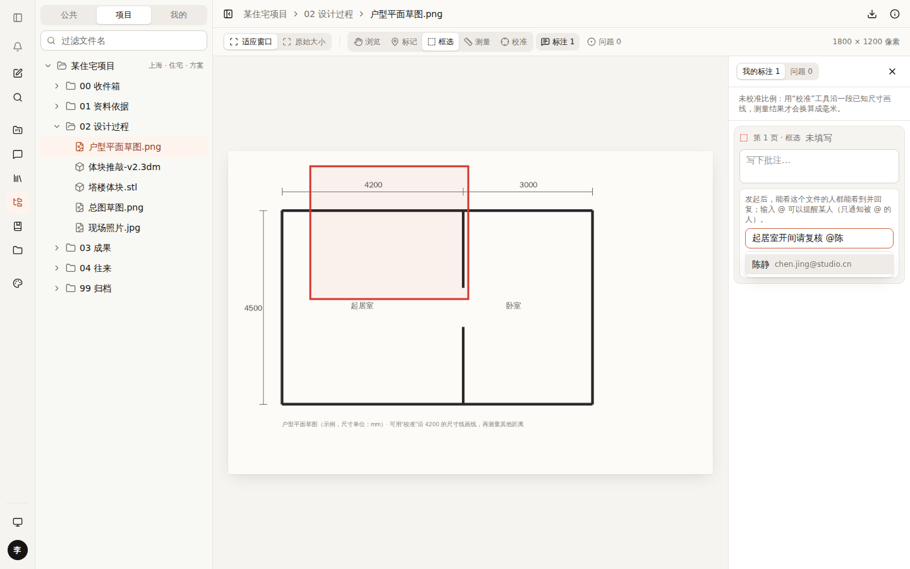
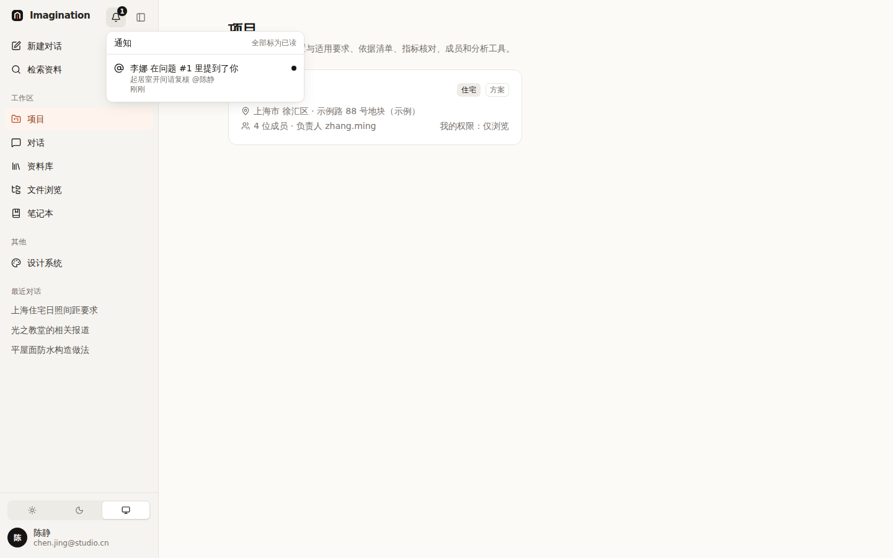
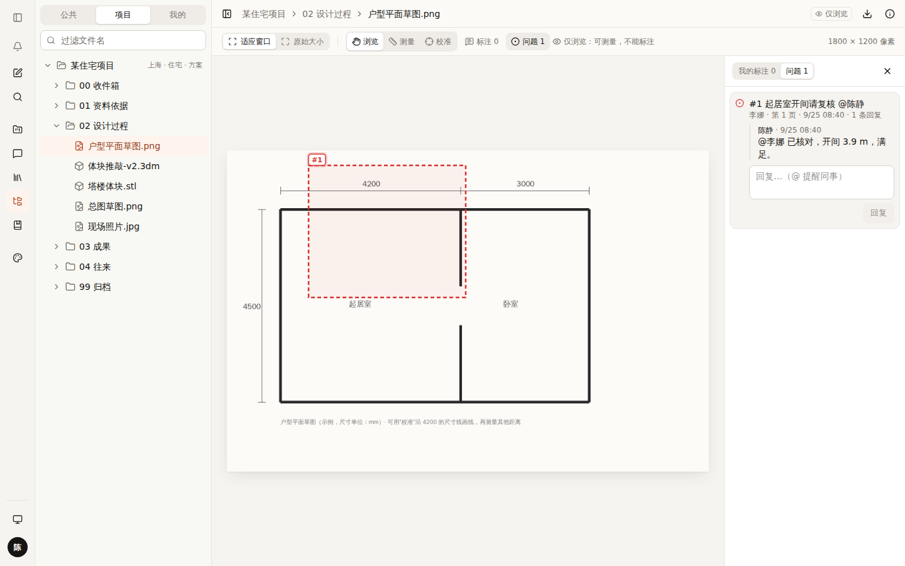
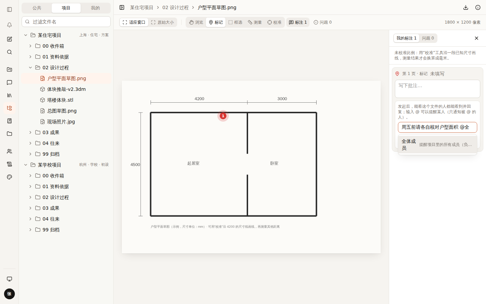
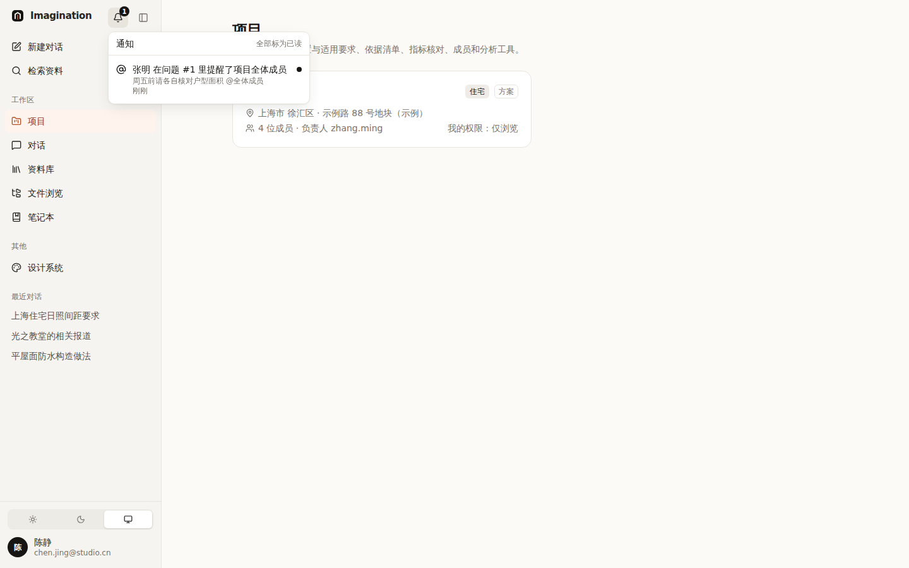

# 015 @提及与通知：只通知被 @ 的人

## 已定下来的

| 项 | 决定 |
|---|---|
| 发起问题 / 回复后通知谁 | **只通知被 @ 的人**（不群发） |

## 方案

```
发起问题 / 回复时输入「@陈」→ 弹出能看这个文件的同事 → 选中 → 「@陈静 」
        │
        ▼ 保存
陈静：侧栏铃铛 🔔1  +  邮件（配置了 Resend 才真正发送）
        │ 点通知
        ▼
直接打开那张图纸、定位到问题 #1
```

- 能 @ 的人 = **能看这个文件**的同事。@ 了看不到文件的人会被拒绝，并提示“先给对方权限再 @”——避免对方点开通知却打不开。
- 自己 @ 自己、已停用的账号不通知。
- 铃铛：有未读时显示数字（中性色，不用强调色）；每分钟、切回页面时刷新；可以“全部标为已读”。
- 发起成功的提示会写清楚“已通知 陈静”。

| 输入 @ 选人 | 铃铛与通知 | 回复里 @ 回去 |
|---|---|---|
|  |  |  |

## 用到的设计知识

- **@提及（Mention）**：微信群、飞书、GitHub、Figma 都用的方式——在正文里点名，被点名的人收到提醒。比“关注 / 订阅”简单，也不会打扰无关的人。
- **通知疲劳**：通知太多，大家就会忽略所有通知。只通知被点名的人，保证每条通知都和收到的人有关。
- **组合框（Combobox，WAI-ARIA）**：输入框 + 候选列表；键盘 ↑↓ 选择、Enter / Tab 确认、Esc 关闭，读屏软件能读出候选。
- **防错**：@ 之前就只列出能看文件的人；绕过界面硬 @ 也会被服务器拒绝。

## 备选方案与取舍

| 方案 | 结论 |
|---|---|
| 通知项目全体成员 | 不采用（你选了只通知被 @ 的人） |
| 只做站内通知、不发邮件 | 不采用：不常登录的人会漏看；邮件只发给被 @ 的人，数量可控 |
| 浏览器推送 / 企业微信 | 以后可以加：企业微信需要单独申请应用 |

## 待你决定

- [ ] **要不要能“@整个项目”？**（比如开会前提醒全体）A 不要，保持只 @ 个人 / B 要，但只有负责人能用。推荐 **B**。
- [ ] **邮件多久汇总一次？** A 每次 @ 都立即发 / B 每小时汇总一封。推荐先 **A**，量大了再改 B。

## 改动位置

- `src/lib/server/notifications.ts`、`src/app/api/notifications/route.ts`、`src/lib/notifications.ts`
- `src/lib/server/email.ts`：`mentionEmail`
- `src/lib/server/file-access.ts`：`mentionable`、`checkMentions`；问题和回复接口里校验并通知
- `src/components/drive/annotate/mention-input.tsx`（@ 输入框）、`src/components/account/notification-bell.tsx`（铃铛，放在侧栏顶部）

## 补充：@全体成员（负责人决定：可以）

- 在项目文件里，**负责人和管理员**输入“@全”会看到“全体成员”，发出后项目里每一位成员都会收到通知（“提醒了项目全体成员”）。
- 可编辑 / 仅浏览的成员看不到这个选项；绕过界面也会被服务器拒绝——避免人人都能群发。

| 负责人 @全体成员 | 成员收到的通知 |
|---|---|
|  |  |

- @全体成员通知项目里的**所有成员**，包括仅浏览（负责人已定）。

