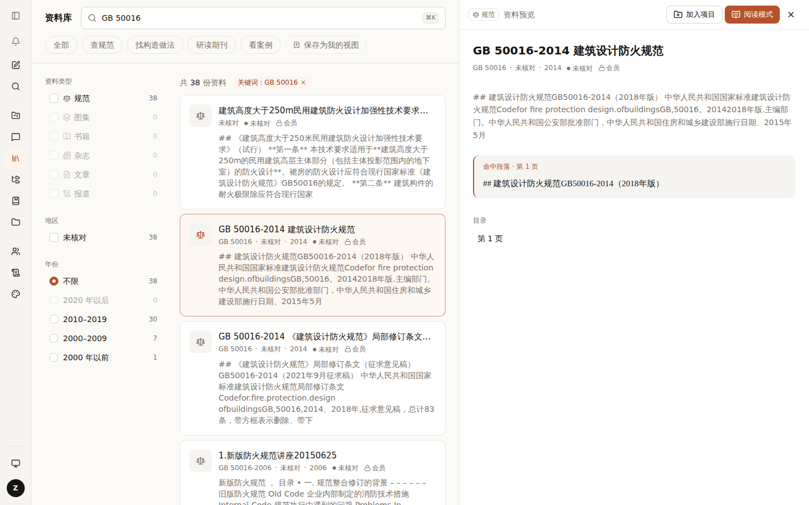
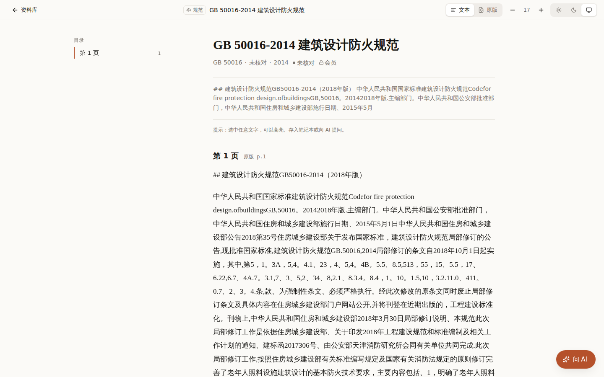

# 016 资料库接真资料：资料仓库与“未核对”状态

## 要解决的问题

资料库和阅读页原来直接读演示数据（17 个组件各自 import `mock.ts`）。要换成 Cairn 知识库里的真规范，得先有一个“从哪取资料”的入口；真资料缺的字段（效力状态、地区）也不能编。

## 方案

```
浏览器                         服务器
资料库 / 预览 ── /api/sources ──▶ sourcesRepo() ──┬─ mock（演示）
阅读页（服务端组件） ────────────▶                 └─ cairn-kb（资料卡目录，只读）
                     必须登录（语料不对外）
```

- 资料仓库 `src/lib/server/sources-repo.ts`：一个接口、两种实现，环境变量 `SOURCES_BACKEND` 选。
- 列表只传元信息（不含正文）；预览、阅读时才取单份全文。服务器内存里也只放元信息，正文打开时从盘上读。
- 资料卡里没有效力状态 ⇒ 显示 **“未核对”**（灰色），**永不默认“现行”**；没有地区 ⇒ 记“地区未核对”。
- 列表一次只画前 100 份，总数照常显示。
- 这一刀只接资料库、预览、阅读页；对话、项目、笔记本、文件浏览里的资料仍是演示数据。

| 资料库 + 预览 | 阅读页 |
|---|---|
|  |  |

（截图里地区还显示“未核对”，之后改成了“地区未核对”，免得和效力状态的“未核对”混在一起。）

## 用到的设计知识

- **诚实的空值（Honest empty state）**：不知道的就说不知道。把“没核对过”显示成“现行”，读者会把它当依据用；灰色的“未核对”让不确定看得见。对应 Nielsen 十大原则第 1 条“系统状态可见”。
- **适配器（Adapter）**：界面只认一个接口，后面换数据源不用改界面。

## 备选方案与取舍

| 方案 | 结论 |
|---|---|
| 地区、状态缺的就留空 | 不用：留空的格子会被读成“没有要求” |
| 一次把全部资料（含正文）发给浏览器 | 不用：正文 400 MB 级 |
| 服务器端分页搜索接口 | 以后再做：3,000 份的元信息 1–2 MB，前端筛选、分面计数够用 |

## 待你决定

- [ ] 效力状态怎么补：A 从规范的发布 / 废止公告自动核对（推荐，有出处）/ B 人工逐本标注

## 改动位置

`src/lib/server/sources-repo.ts` · `src/app/api/sources/**` · `src/hooks/use-sources.ts` · `src/components/library/*` · `src/components/source/*` · `src/app/(focus)/library/[id]/page.tsx` · `src/lib/sources/{types,kinds,filters}.ts`
